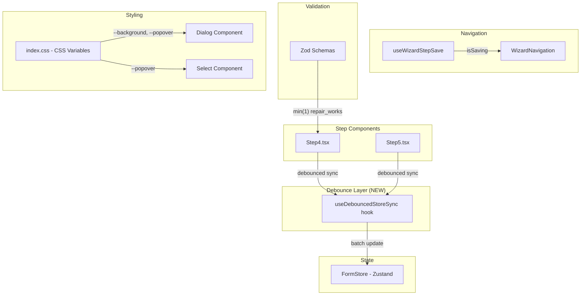

# Design Document: Frontend Optimization

## Overview

Данный документ описывает технический дизайн для исправления 5 проблем фронтенда AvtoExpert Pro:

1. **Производительность** — замена `useWatch({ control })` + useEffect на debounced-синхронизацию с Zustand store
2. **CSS-переменные** — добавление shadcn/ui theme tokens в index.css
3. **Состояние загрузки** — добавление `isSaving` состояния в кнопку "Далее"
4. **Валидация repair_works** — добавление `.min(1)` в Zod-схему шага 4
5. **Zod v4 совместимость** — миграция `required_error` → `error` в схемах

Стек: React 19, Vite 8, Tailwind CSS v4, Zod v4.4.3, React Hook Form 7.79, Zustand 5, Radix UI, fast-check 4.8.

## Architecture



## Components and Interfaces

### 1. `useDebouncedStoreSync` — новый custom hook

```typescript
/**
 * Хук для debounced-синхронизации данных формы с Zustand store.
 * Заменяет паттерн useWatch + useEffect.
 */
function useDebouncedStoreSync<T>(
  control: Control<T>,
  setter: (data: T) => void,
  delay?: number // default: 300ms
): void;
```

**Логика:**
- Использует `useWatch({ control })` внутри, но обновляет store только после `delay` мс без изменений
- Использует `useRef` для хранения таймера (не вызывает ре-рендер)
- Очищает таймер при unmount через `useEffect` cleanup

### 2. `useWizardStepSave` — расширение возвращаемого интерфейса

```typescript
interface UseWizardStepSaveReturn {
  handleSaveAndNext: () => void;
  mutationError: string | null;
  resetErrors: () => void;
  isSaving: boolean; // NEW — derived from mutation.isPending states
}
```

### 3. `WizardNavigation` — расширение props

```typescript
interface WizardNavigationProps {
  onNext: () => void;
  onPrevious: () => void;
  canGoNext: boolean;
  canGoPrevious: boolean;
  isLastStep: boolean;
  isSaving?: boolean; // NEW
}
```

### 4. CSS Theme Layer — shadcn/ui переменные

Все переменные определяются в `:root` в `index.css` после существующих custom переменных. Значения подбираются так, чтобы соответствовать текущей дизайн-системе проекта (светлая тема, синие акценты).

### 5. Zod Schema Migration

Замена устаревшего API:
```typescript
// Zod v3 (УСТАРЕЛО)
z.number({ required_error: "Сообщение" })
z.enum([...], { required_error: "Сообщение" })

// Zod v4 (НОВОЕ)
z.number({ error: "Сообщение" })
z.enum([...], { error: "Сообщение" })
```

## Data Models

### Debounce Timer State (внутренний, в useRef)

```typescript
// Внутри useDebouncedStoreSync
const timerRef = useRef<ReturnType<typeof setTimeout> | null>(null);
```

### CSS Variables Contract

```css
:root {
  /* shadcn/ui theme tokens */
  --background: 0 0% 100%;
  --foreground: 222.2 84% 4.9%;
  --card: 0 0% 100%;
  --card-foreground: 222.2 84% 4.9%;
  --popover: 0 0% 100%;
  --popover-foreground: 222.2 84% 4.9%;
  --primary: 221.2 83.2% 53.3%;
  --primary-foreground: 210 40% 98%;
  --secondary: 210 40% 96.1%;
  --secondary-foreground: 222.2 47.4% 11.2%;
  --muted: 210 40% 96.1%;
  --muted-foreground: 215.4 16.3% 46.9%;
  --accent: 210 40% 96.1%;
  --accent-foreground: 222.2 47.4% 11.2%;
  --destructive: 0 84.2% 60.2%;
  --destructive-foreground: 210 40% 98%;
  --border: 214.3 31.8% 91.4%;
  --input: 214.3 31.8% 91.4%;
  --ring: 221.2 83.2% 53.3%;
  --radius: 0.5rem;
}
```

Формат HSL без `hsl()` wrapper — стандарт shadcn/ui для Tailwind v4.

### step4Schema с валидацией

```typescript
export const step4Schema = z.object({
  hourly_rate: z
    .number({ error: "Укажите нормо-час" })
    .positive("Нормо-час должен быть больше 0"),
  repair_works: z.array(repairWorkSchema).min(1, "Добавьте минимум одну ремонтную работу"),
  paint_works: z.array(paintWorkSchema),
  spare_parts: z.array(sparePartSchema),
  materials: z.array(materialSchema),
});
```

## Correctness Properties

*A property is a characteristic or behavior that should hold true across all valid executions of a system—essentially, a formal statement about what the system should do. Properties serve as the bridge between human-readable specifications and machine-verifiable correctness guarantees.*

### Property 1: Debounce batches rapid changes into a single store update

*For any* sequence of N rapid value changes (where N ≥ 1) occurring within the debounce window, the store setter SHALL be called exactly once after the debounce delay expires, and SHALL receive the value from the last change in the sequence.

**Validates: Requirements 1.1, 1.2, 1.3, 1.4**

### Property 2: repair_works minimum validation

*For any* Step4FormData object, the step4Schema SHALL report the data as valid if and only if the `repair_works` array contains at least 1 element (with valid fields), AND the `hourly_rate` is positive.

**Validates: Requirements 4.1, 4.2, 4.4**

## Error Handling

| Сценарий | Обработка |
|----------|-----------|
| Save mutation fails | Кнопка "Далее" возвращается в enabled состояние, отображается ошибка через `mutationError` |
| Debounce during unmount | Timer очищается в useEffect cleanup, предотвращая memory leak и обновление unmounted компонента |
| Schema validation error | FormMessage показывает ошибку под соответствующим полем / секцией |
| CSS variable not resolved | Fallback через Tailwind defaults; shadcn/ui компоненты получают белый фон |

## Testing Strategy

### Property-Based Tests (fast-check)

Проект уже имеет `fast-check` v4.8.0 в devDependencies и `vitest` v4.1.9.

- **Property 1**: Тест debounce-утилиты — генерация случайных последовательностей вызовов с `vi.useFakeTimers()`, проверка что setter вызывается ровно 1 раз с последним значением
- **Property 2**: Тест step4Schema — генерация случайных Step4FormData через fast-check арбитрары, проверка что schema.safeParse возвращает success=true ↔ repair_works.length ≥ 1 AND hourly_rate > 0

Конфигурация: минимум 100 итераций на property test.

### Unit Tests (example-based)

- WizardNavigation: рендер с `isSaving=true` → кнопка disabled + spinner
- WizardNavigation: рендер с `isSaving=false` → кнопка enabled + нормальный текст
- step4Schema: 0 repair_works → error message "Добавьте минимум одну ремонтную работу"
- CSS variables: проверка наличия всех переменных в index.css (lint/snapshot)

### Smoke Tests

- TypeScript compilation: `tsc --noEmit` проходит без ошибок в schema файлах
- Vite build: `vite build` завершается успешно

### Integration Tests

- Dialog/Select рендерятся с непрозрачным фоном (visual snapshot или computed style check)
