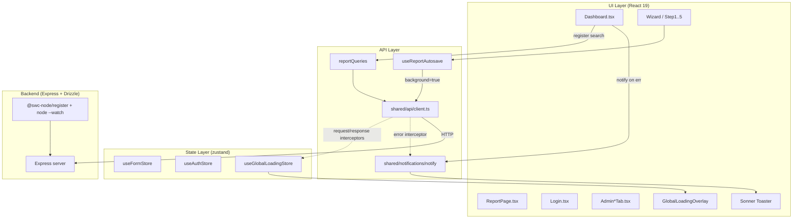
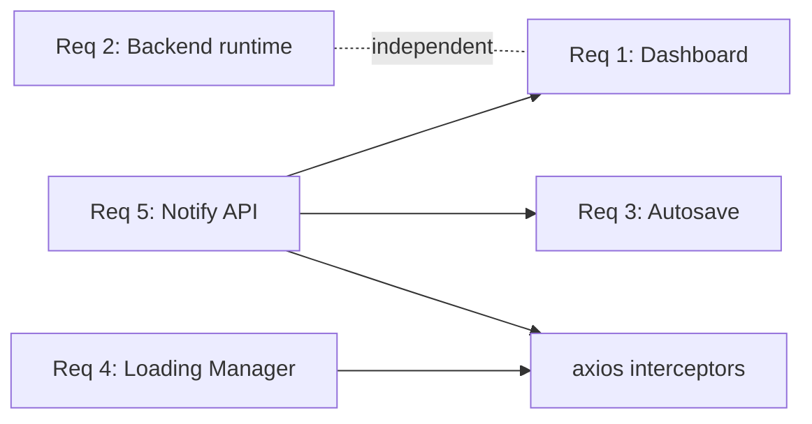
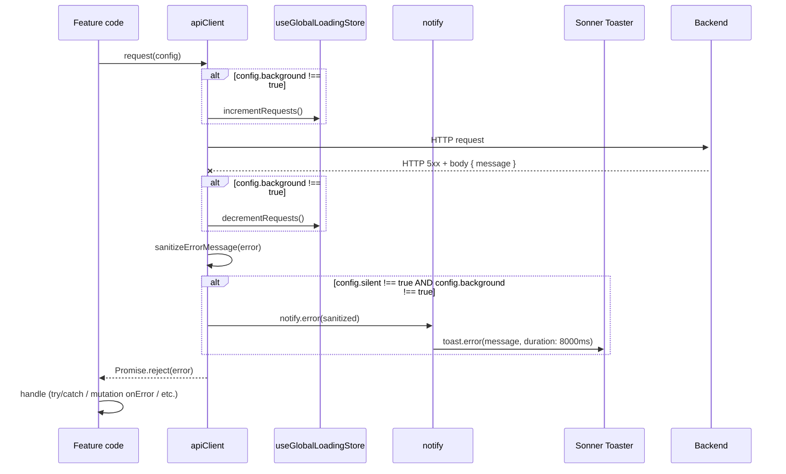

# Design Document

## Overview

Этот дизайн описывает реализацию пяти связанных улучшений UX и производительности AvtoExpert Pro:

1. **Восстановление отзывчивости поиска на Dashboard** — устранение размонтирования `Search_Input` во время повторных запросов TanStack Query (root cause — конструкция `if (isLoading) return <Skeleton/>` в `Dashboard.tsx`, которая срабатывает на каждом изменении ключа запроса).
2. **Замена backend TypeScript-runtime** — переход с `tsx` CLI на `@swc-node/register` в связке с нативным `node --watch` для ускорения холодного старта и реакции на изменения.
3. **Конфигурируемый автосейв 60 секунд** — введение единой константы `AUTOSAVE_INTERVAL_MS` в централизованном модуле `features/reports/lib/autosave.config.ts` и рефакторинг `useReportAutosave` для чтения из этой константы.
4. **Глобальный Loading-Manager и блокирующий overlay** — централизованный zustand store, axios interceptors (request/response), флаг `background` для axios config, интеграция с программной навигацией react-router-dom, overlay-компонент с 200ms-debounce.
5. **Toast-уведомления через Sonner** — публичный API `notify` поверх `sonner`, монтаж `<Toaster />` в корне приложения, перехват необработанных ошибок HTTP_Client, миграция всех transient-вызовов `AppAlert` на toast.

Все пять требований объединены одним спеком, потому что они затрагивают одни и те же контракты: реакцию UI на состояние сетевых запросов (loading/error/success) и единый способ сообщать пользователю о результате. Решения по требованиям 4 и 5 устанавливают общую инфраструктуру (loading store + notify API), на которую опираются требования 1 и 3 (Dashboard и autosave используют notify для ошибок согласно AC 1.9 и AC 3.9).

### Источники проектных решений

- **Архитектура feature-sliced** — соблюдён существующий layout `frontend/src/features/<feature>/{api,hooks,model,ui,lib}` и `frontend/src/shared/{api,auth,lib,context}`.
- **shadcn/ui Sonner** — официальная обёртка [shadcn.com/docs/components/sonner](https://ui.shadcn.com/docs/components/sonner) над библиотекой `sonner` от Эмиля Кёвикиса.
- **TanStack Query placeholderData** — паттерн сохранения предыдущих данных при смене queryKey ([TanStack Query — Paginated/Lagged Queries](https://tanstack.com/query/latest/docs/framework/react/guides/paginated-queries)).
- **@swc-node/register** — Rust-based TS loader на основе SWC, документация [@swc-node/register npm](https://www.npmjs.com/package/@swc-node/register).
- **Node `--watch` (stable since v22)** — встроенный watcher Node без внешних зависимостей.

---

## Architecture

### High-level diagram



### Layered responsibilities

| Layer | Concern | Modules added or modified |
| --- | --- | --- |
| Runtime | TS execution на бэкенде | `backend/package.json` scripts, devDependencies |
| Persistent config | Magic numbers | `features/reports/lib/autosave.config.ts` |
| Global state | Loading-counter, navigation flag | `shared/loading/useGlobalLoadingStore.ts` |
| HTTP transport | Counter wiring, error mapping | `shared/api/client.ts` (interceptors) |
| UI primitives | Toast, overlay | `shared/notifications/notify.ts`, `components/ui/sonner.tsx`, `components/ui/global-loading-overlay.tsx` |
| Feature UI | Dashboard refactor, AppAlert migration | `features/reports/ui/Dashboard.tsx`, `features/reports/ui/Step1.tsx`, `Step5.tsx`, `ExpertManagerModal.tsx`, `features/auth/ui/Login.tsx`, `features/admin/ui/*.tsx` |
| Feature hook | Autosave refactor | `features/reports/hooks/useReportAutosave.ts` |

### Cross-requirement dependencies



`Notification_System` (req 5) — это hard dependency для req 1 (AC 1.9) и req 3 (AC 3.9). `Global_Loading_Manager` (req 4) живёт в тех же axios-интерсепторах, что и единая error-toast интеграция (AC 5.12). Реализуем оба требования согласованно в одном проходе по `shared/api/client.ts`. Req 2 (backend runtime) полностью изолирован от фронтенда.

---

## Components and Interfaces

### 3.1 Dashboard search responsiveness (Requirement 1)

#### Root cause analysis

Текущий `Dashboard.tsx` в первых 70 строках содержит две конструкции, которые **полностью размонтируют** дерево, включая `Search_Input`:

```tsx
// Строки 49–60: первичная загрузка → весь Dashboard заменяется на Skeleton
if (isLoading) {
  return (
    <AppLayout>
      <div className="space-y-3">
        <Skeleton className="h-10 w-1/3" />
        {Array.from({ length: 5 }).map((_, i) => (
          <Skeleton key={i} className="h-12 w-full" />
        ))}
      </div>
    </AppLayout>
  );
}

// Строки 67–69: ошибка без кэшированных данных → весь Dashboard заменяется на AppAlert
if (error && reports.length === 0) {
  return <AppAlert type="error" message={error} />;
}
```

`useReportsQuery({ page, search, limit })` использует параметры в `queryKey`. Когда пользователь вводит символ, `useDashboard.useEffect` через 300 мс коммитит новый `searchQuery`, и TanStack Query создаёт **новый ключ**. Без `placeholderData` для нового ключа кэша нет → `reportsQuery.isLoading === true` снова → ранний return → input исчезает из DOM → React теряет фокус и позицию каретки.

Дополнительный риск: при возврате на dashboard после генерации (location.state.justGenerated) выполняется invalidate; даже если кэш есть, есть кейсы, где данные ещё не приходят и `isLoading` снова true.

#### Fix approach

1. **Сохраняем предыдущие данные при смене queryKey.** В `useReportsQuery` добавить `placeholderData: keepPreviousData`:
   ```ts
   import { keepPreviousData, useQuery } from "@tanstack/react-query";

   export function useReportsQuery(params: ReportsQueryParams) {
     return useQuery({
       queryKey: reportQueryKeys.list(params),
       queryFn: () => reportService.getReports(params),
       placeholderData: keepPreviousData,
     });
   }
   ```
   После этого при смене `search` query становится `isFetching=true`, но `isLoading=false` и `data` остаются доступны.

2. **Различаем "первый раз без данных" и "повторный запрос".** В `useDashboard` добавляем:
   ```ts
   const isInitialLoading = reportsQuery.isLoading && !reportsQuery.data;
   ```
   и возвращаем как отдельное поле `isInitialLoading`. Поле `isLoading` оставляем для обратной совместимости, но в Dashboard используем именно `isInitialLoading`.

3. **Перестраиваем JSX так, что header и Search_Input всегда смонтированы.** Удаляем оба ранних `return`. Skeleton рендерится только внутри области списка. Ошибка — только внутри области списка. Стабильность ключа `Input` достигается тем, что он находится в одном и том же месте дерева без условного branch:

   ```tsx
   return (
     <AppLayout>
       <DashboardHeader pagination={pagination} reports={reports} />
       <DashboardSearchBar
         register={register}
         isFetching={reportsQuery.isFetching}
         searchQuery={searchQuery}
         onClear={handleClearSearch}
       />
       {/* TableArea — единственная область, которая меняет содержимое */}
       <DashboardTableArea
         isInitialLoading={isInitialLoading}
         error={error && reports.length === 0 ? error : null}
         reports={reports}
         pagination={pagination}
         currentPage={currentPage}
         onPageChange={setCurrentPage}
         onDelete={handleDeleteReport}
         isDeletePending={deleteReportMutation.isPending}
       />
     </AppLayout>
   );
   ```

   `DashboardSearchBar` инкапсулирует `<Input {...register("search")} />` и спиннер `<Loader2 />`. Это гарантирует, что **позиция input в дереве React стабильна** (то же место, тот же родитель), и React не пересоздаёт DOM-узел.

4. **Стабильный key.** Внутри `DashboardTableArea` оборачиваем skeleton/error/empty/table в один и тот же тег `<section>` с фиксированным `key="list"`, чтобы переключения состояний не сбрасывали внешние слоты.

5. **Удаление inline AppAlert (req 5).** Все три call site `AppAlert` в `Dashboard.tsx` мигрируют:
   - `<AppAlert type="success" message="Заключение успешно сгенерировано">` → `useEffect` вызывает `notify.success("Заключение успешно сгенерировано")` и сразу очищает `location.state.justGenerated` (без локального таймера 5s — этим занимается Sonner, AC 5.7).
   - `<AppAlert type="error" message={error}>` сверху (при empty list) — заменяется на блок "Ошибка загрузки" внутри `DashboardTableArea`, который остаётся inline как Persistent_Status_Message (AC 5.11), потому что заменяет основное содержимое.
   - Второй inline `<AppAlert type="error">` после search bar **удаляется полностью**: ошибка показывается через notify (AC 1.9, 5.4, 5.12).

6. **AC 1.4 — индикатор исчезает быстро.** Спиннер `<Loader2>` контролируется напрямую `reportsQuery.isFetching`. TanStack Query синхронно обновляет этот флаг при resolve/reject, react рендерит в следующий microtask. Без debounce — это даёт ≤ 1 кадр (~16 мс) ≪ 100 мс.

7. **AC 1.6 — keystroke виден в DOM ≤ 50 мс.** Поскольку `<Input {...register("search")} />` — uncontrolled с RHF (RHF использует ref-based subscriptions), значение в DOM устанавливается синхронно браузером в обработчике события `input`. Никакая обработка React в этом пути не блокирует ввод. Debounce в `useDashboard.useEffect` не задерживает отображение DOM-значения, только коммит `searchQuery` в state.

#### Module diff

| Файл | Изменение |
| --- | --- |
| `features/reports/model/reportQueries.ts` | `useReportsQuery` — добавить `placeholderData: keepPreviousData` |
| `features/reports/hooks/useDashboard.ts` | Добавить поле `isInitialLoading` в return |
| `features/reports/ui/Dashboard.tsx` | Удалить ранние `return`; вынести header/search/list в дочерние компоненты или inline-блоки с фиксированной позицией в дереве; заменить транзиентные AppAlert на `notify.*` |
| `features/reports/ui/DashboardSearchBar.tsx` (новый) | Изолированный компонент search input + spinner |
| `features/reports/ui/DashboardTableArea.tsx` (новый) | skeleton/error/empty/table в одной области |

### 3.2 Backend TypeScript runtime (Requirement 2)

#### Выбор: `@swc-node/register` + Node native `--watch`

Из множества `{@swc-node/register, esbuild-runner, vite-node, Node --experimental-strip-types, Bun}` выбран **`@swc-node/register`** в связке с встроенным флагом Node.js `--watch`.

#### Обоснование

| Кандидат | Скорость TS-трансформации | Watch-механизм | ESM | tsconfig paths | Node-only зависимости (pg, drizzle, multer) | Локальная установка | Зрелость / поддержка |
| --- | --- | --- | --- | --- | --- | --- | --- |
| `tsx` (текущий) | esbuild — быстрая, но есть overhead spawn | через `tsx watch` (chokidar) | ✓ | ✓ | ✓ | ✓ | стабилен, ~4.21 |
| **`@swc-node/register`** ✓ | **SWC (Rust) — самая быстрая трансформация** | **Node native `--watch`** (Node 22 LTS, stable) | ✓ через `register/esm-register` | ✓ через свой resolver + tsconfig | ✓ полная совместимость | ✓ devDep | зрелый, активно поддерживается |
| `esbuild-runner` | esbuild | внешний `nodemon` | частично | ограниченно | ✓ | ✓ | устаревает |
| `vite-node` | esbuild | `vite-node --watch` | ✓ | ✓ | риск с нативными модулями (`pg-native`, `multer` heap-deps) | ✓ | завязан на Vite-pipeline (избыточно для бэкенда) |
| Node `--experimental-strip-types` | нативная (только стрипинг типов, не трансформирует enum/decorators/JSX) | `--watch` | ✓ | ✗ (нет path-mapping) | ✓ | ✓ | экспериментально, требует Node 22.6+; конфликт с `verbatimModuleSyntax` и `moduleResolution: bundler` |
| Bun | очень быстрая | `bun --watch` | ✓ | ✓ | риск с native Node-модулями (Drizzle Postgres, pg, multer) | требует Bun-installation глобально | смена рантайма — высокий риск регресса |

Решение:
- `@swc-node/register` даёт **максимально быструю трансформацию TS** на холодном старте (SWC примерно в 10–20 раз быстрее tsc и заметно быстрее esbuild на трансформации одного файла; для горячих перезапусков это критично).
- Использование Node native `--watch` (stable с Node 22) убирает зависимость от `chokidar` и spawn-overhead `tsx watch`.
- Сохраняется полная совместимость с ESM (`"type": "module"`), tsconfig paths, нативными зависимостями (`pg`, `drizzle-orm`, `multer`).
- Чисто локальная установка как `devDependency`, без глобального рантайма (требование AC 2.9).

#### `backend/package.json` scripts (целевое состояние)

```jsonc
{
  "engines": {
    "node": ">=22.0.0"
  },
  "scripts": {
    "dev": "node --watch --import @swc-node/register/esm-register src/server.ts",
    "build": "tsc",
    "typecheck": "tsc --noEmit",
    "start": "node dist/server.js",
    "db:seed": "node --import @swc-node/register/esm-register src/db/seed.ts"
  },
  "devDependencies": {
    "@swc-node/register": "^1.10.10",
    "@swc/core": "^1.13.20",
    "typescript": "^5.9.3"
    // tsx удаляется
  }
}
```

Заметки:
- `--import` — синхронный ESM loader hook (стабилизирован в Node 20.6 / 22 LTS). Не использует устаревший `--loader`.
- `@swc-node/register/esm-register` автоматически читает `tsconfig.json` из cwd, поддерживая `paths`, `baseUrl`, `verbatimModuleSyntax`.
- `tsc --noEmit` остаётся отдельной командой `typecheck` (AC 2.8). `npm run build` (`tsc`) сохраняется для production-сборки (AC 2.7).
- `db:seed` использует тот же loader без `--watch`, чтобы скрипт завершился (AC 2.4).

#### Targets (нефункциональные)

| Метрика | Целевое значение (AC) | Ожидаемое значение с `@swc-node/register` |
| --- | --- | --- |
| Холодный старт (`npm run dev`) до "listening" | ≤ 2000 мс (AC 2.2) | ~600–1200 мс на референсной dev-машине (4C/8GB/SSD) |
| Перезапуск после изменения `.ts` | ≤ 1500 мс (AC 2.3) | ~300–700 мс (SWC incremental + Node native watcher) |
| `npm run db:seed` exit code 0 | требуется (AC 2.4) | ✓ |
| ESM + tsconfig paths | требуется (AC 2.5, 2.6) | ✓ |
| `tsc` production build | требуется (AC 2.7) | ✓ (без изменений) |

Замеры приведены как ориентир, целевая проверка — измерение по AC 2.2 и AC 2.3 на референсной машине.

### 3.3 Configurable autosave interval (Requirement 3)

#### Module: `features/reports/lib/autosave.config.ts`

Новый модуль — **единственный источник истины** для константы автосейва (AC 3.2):

```ts
// frontend/src/features/reports/lib/autosave.config.ts

/**
 * Задержка автосохранения мастера заключения, миллисекунды.
 *
 * Допустимый диапазон [1000, 600000] (AC 3.1).
 * Применяется в useReportAutosave, шаги 2/3/4 wizard.
 *
 * ВАЖНО: это единственное место в кодовой базе, где объявлено числовое
 * значение интервала автосохранения (AC 3.2).
 */
export const AUTOSAVE_INTERVAL_MS = 60_000;

/** Шаги мастера, на которых выполняется автосохранение (AC 3.4). */
export const AUTOSAVE_ELIGIBLE_STEPS = [2, 3, 4] as const;
export type AutosaveEligibleStep = (typeof AUTOSAVE_ELIGIBLE_STEPS)[number];
```

Расположение в `features/reports/lib` обосновано тем, что константа специфична для feature `reports` и не используется другими feature. Если в будущем появится глобальная конфигурация UX-таймингов — модуль переедет в `shared/config/`, но это вне scope текущего спека.

#### Hook refactor: `useReportAutosave.ts`

Текущий хук содержит числовой литерал `30_000` (см. `frontend/src/features/reports/hooks/useReportAutosave.ts` строка 33). Целевое состояние:

```ts
import { useEffect, useState } from "react";
import { useFormStore } from "../model/useFormStore";
import { reportService } from "../api/reportApi";
import {
  AUTOSAVE_INTERVAL_MS,
  AUTOSAVE_ELIGIBLE_STEPS,
  type AutosaveEligibleStep,
} from "../lib/autosave.config";
import { notify } from "@/shared/notifications/notify";

interface UseReportAutosaveParams {
  reportId?: string;
  currentStep: number;
}

export interface UseReportAutosaveReturn {
  isSaving: boolean;
}

function isAutosaveEligibleStep(step: number): step is AutosaveEligibleStep {
  return (AUTOSAVE_ELIGIBLE_STEPS as readonly number[]).includes(step);
}

export function useReportAutosave({
  reportId,
  currentStep,
}: UseReportAutosaveParams): UseReportAutosaveReturn {
  const step2 = useFormStore((s) => s.step2);
  const step3 = useFormStore((s) => s.step3);
  const step4 = useFormStore((s) => s.step4);
  const [isSaving, setIsSaving] = useState(false);

  useEffect(() => {
    // AC 3.4 — выходим без планирования таймера при недопустимом состоянии
    if (!reportId) return;
    if (!isAutosaveEligibleStep(currentStep)) return;

    const timeoutId = setTimeout(async () => {
      setIsSaving(true);
      try {
        // AC 3.10 — store не мутируется; передаём snapshot значений
        // background=true (req 4, AC 4.4) — autosave не должен показывать overlay
        await reportService.autosave(
          reportId,
          { step2, step3, step4 },
          { background: true },
        );
      } catch (err) {
        // AC 3.9 — индикация ошибки идёт через Notification_System (req 5)
        notify.error("Не удалось сохранить черновик", {
          description: "Изменения сохранены локально и будут отправлены при следующем автосейве.",
        });
        // AC 3.10 — состояние useFormStore не трогаем; данные остаются для следующего цикла
      } finally {
        setIsSaving(false); // AC 3.8
      }
    }, AUTOSAVE_INTERVAL_MS);

    return () => clearTimeout(timeoutId); // AC 3.5 — отмена предыдущего таймера
  }, [currentStep, reportId, step2, step3, step4]);

  return { isSaving };
}
```

Ключевые свойства:
- Числовой литерал отсутствует — только импорт `AUTOSAVE_INTERVAL_MS` (AC 3.1, 3.2).
- `useEffect` deps включают `step2/step3/step4`: каждое изменение полей пересоздаёт effect, что а) отменяет предыдущий таймер через cleanup (AC 3.5) и б) запускает новый (AC 3.6). Это даёт invariant "одновременно существует не более одного запланированного таймера" (AC 3.6).
- `reportService.autosave` принимает третий аргумент — `axios config` с `background: true` (см. §3.4).
- `notify.error` вместо предыдущего `console.error` (AC 3.9).

#### `reportService.autosave` signature change

```ts
// features/reports/api/reportApi.ts
async autosave(
  id: string,
  payload: { step2: Step2Data | null; step3: Step3Data | null; step4: Step4Data | null },
  config?: { background?: boolean },
): Promise<void> {
  await apiClient.patch(`/reports/${id}/autosave`, toApiAutosave(payload), config);
}
```

### 3.4 Global Loading Manager and Overlay (Requirement 4)

#### Module: `shared/loading/useGlobalLoadingStore.ts`

```ts
import { create } from "zustand";

interface GlobalLoadingState {
  /** Счётчик инициированных, но ещё не завершённых non-background HTTP-запросов (AC 4.1). */
  pendingRequests: number;
  /** Флаг активного навигационного перехода (AC 4.1). */
  isNavigationPending: boolean;
  /** Timestamp начала текущего непрерывного активного периода. Для диагностики (AC 4.12). */
  activeSince: number | null;
  /** Идентификатор последнего записанного предупреждения о >30s. Для подавления повторов (AC 4.12). */
  lastWarnedIncidentId: string | null;
}

interface GlobalLoadingActions {
  /** AC 4.2 — атомарный inc на старте запроса. */
  incrementRequests: () => void;
  /** AC 4.3 — атомарный dec на завершении; не уходит ниже 0. */
  decrementRequests: () => void;
  /** AC 4.5 — установить флаг навигации. */
  startNavigation: () => void;
  /** AC 4.5 — сбросить флаг навигации. */
  endNavigation: () => void;
}

export const useGlobalLoadingStore = create<
  GlobalLoadingState & GlobalLoadingActions
>((set, get) => ({
  pendingRequests: 0,
  isNavigationPending: false,
  activeSince: null,
  lastWarnedIncidentId: null,

  incrementRequests: () =>
    set((s) => {
      const next = s.pendingRequests + 1;
      const wasActive = s.pendingRequests > 0 || s.isNavigationPending;
      return {
        pendingRequests: next,
        activeSince: wasActive ? s.activeSince : Date.now(),
      };
    }),

  decrementRequests: () =>
    set((s) => {
      // AC 4.3 — clamp at 0
      const next = Math.max(0, s.pendingRequests - 1);
      const stillActive = next > 0 || s.isNavigationPending;
      return {
        pendingRequests: next,
        activeSince: stillActive ? s.activeSince : null,
        lastWarnedIncidentId: stillActive ? s.lastWarnedIncidentId : null,
      };
    }),

  startNavigation: () =>
    set((s) => {
      const wasActive = s.pendingRequests > 0 || s.isNavigationPending;
      return {
        isNavigationPending: true,
        activeSince: wasActive ? s.activeSince : Date.now(),
      };
    }),

  endNavigation: () =>
    set((s) => {
      const stillActive = s.pendingRequests > 0;
      return {
        isNavigationPending: false,
        activeSince: stillActive ? s.activeSince : null,
        lastWarnedIncidentId: stillActive ? s.lastWarnedIncidentId : null,
      };
    }),
}));

/** Производное состояние "loading активен" (AC 4.6). */
export const selectIsActive = (s: GlobalLoadingState): boolean =>
  s.pendingRequests > 0 || s.isNavigationPending;
```

`zustand` выбран, потому что:
- Проект уже использует zustand для `useFormStore`, `useAuthStore`.
- Store с примитивными счётчиками и одним boolean — минимальный overhead.
- Доступ из axios interceptors (за пределами React tree) через `useGlobalLoadingStore.getState()` (AC 4.1 требует доступа из любого компонента).

#### Axios `RequestConfig` augmentation

Файл `shared/api/axios.augmentations.d.ts`:

```ts
// Module augmentation — расширяем axios config двумя флагами.
import "axios";

declare module "axios" {
  export interface AxiosRequestConfig {
    /** AC 4.4 — пометка фонового запроса; не влияет на Global_Loading_Manager. */
    background?: boolean;
    /** AC 5.12 — отключает автоматический error-toast (для запросов, ошибки которых обрабатываются локально). */
    silent?: boolean;
  }
}
```

#### Interceptor design (`shared/api/client.ts`)

```ts
import axios, { AxiosError, AxiosHeaders } from "axios";
import { useAuthStore } from "@/shared/auth/useAuthStore";
import { useGlobalLoadingStore } from "@/shared/loading/useGlobalLoadingStore";
import { notify } from "@/shared/notifications/notify";
import { sanitizeErrorMessage } from "@/shared/api/error-mapping";

const apiClient = axios.create({
  baseURL: "/api",
  headers: { "Content-Type": "application/json" },
});

// --- REQUEST INTERCEPTOR ---
apiClient.interceptors.request.use(
  (config) => {
    const token = useAuthStore.getState().token;
    if (token) {
      const headers = AxiosHeaders.from(config.headers);
      headers.set("Authorization", `Bearer ${token}`);
      config.headers = headers;
    }

    // AC 4.2 + 4.4 — increment только для non-background
    if (!config.background) {
      useGlobalLoadingStore.getState().incrementRequests();
    }
    return config;
  },
  (error) => Promise.reject(error),
);

// --- RESPONSE INTERCEPTOR ---
const finalizeRequest = (config: { background?: boolean } | undefined) => {
  if (!config?.background) {
    useGlobalLoadingStore.getState().decrementRequests();
  }
};

apiClient.interceptors.response.use(
  (response) => {
    finalizeRequest(response.config);
    return response;
  },
  (error: AxiosError) => {
    // AC 4.3 — decrement даже при ошибке/отмене
    finalizeRequest(error.config);

    if (error.response?.status === 401) {
      useAuthStore.getState().logout();
      window.location.href = "/login";
      return Promise.reject(error);
    }

    const userMessage = sanitizeErrorMessage(error);
    error.message = userMessage;

    // AC 5.12 — автоматический toast для необработанных ошибок
    if (!error.config?.silent && !error.config?.background) {
      notify.error(userMessage);
    }

    return Promise.reject(error);
  },
);

export default apiClient;
```

`finalizeRequest` вызывается **до** любой проверки 401 и других ветвей — это гарантирует, что счётчик никогда не "повиснет" при специальных кодах (AC 4.13). Для фоновых запросов (autosave) ошибка не превращается в toast — пользователь увидит уведомление через `notify.error` в коде хука (AC 3.9), что даёт более точную формулировку ("Не удалось сохранить черновик…").

#### Diagnostic warning timer (AC 4.12)

Отдельный модуль `shared/loading/diagnostic-watchdog.ts`:

```ts
import { useGlobalLoadingStore, selectIsActive } from "./useGlobalLoadingStore";
import { generateIncidentId } from "@/shared/lib/ids";

const WARN_AFTER_MS = 30_000;

let timerId: number | null = null;

useGlobalLoadingStore.subscribe((state, prev) => {
  const wasActive = selectIsActive(prev);
  const isActive = selectIsActive(state);

  if (!wasActive && isActive) {
    // start watchdog
    timerId = window.setTimeout(() => {
      const current = useGlobalLoadingStore.getState();
      if (!selectIsActive(current)) return;
      if (current.lastWarnedIncidentId) return; // AC 4.12 — не повторяем

      const id = generateIncidentId();
      console.warn(
        `[GlobalLoading] Active for >30s. pendingRequests=${current.pendingRequests}, incidentId=${id}`,
      );
      // Обновляем lastWarnedIncidentId, чтобы не повторять до сброса
      useGlobalLoadingStore.setState({ lastWarnedIncidentId: id });
    }, WARN_AFTER_MS);
  }
  if (wasActive && !isActive && timerId !== null) {
    window.clearTimeout(timerId);
    timerId = null;
  }
});
```

#### Navigation transition integration

Так как проект использует `<BrowserRouter>` + `<Routes>` (declarative routing, не data router из react-router 7), хук `useNavigation()` недоступен. Реализация:

1. **Хук `useGlobalNavigate`** оборачивает `useNavigate` из `react-router-dom`:
   ```ts
   import { useNavigate, type NavigateFunction } from "react-router-dom";
   import { useGlobalLoadingStore } from "@/shared/loading/useGlobalLoadingStore";

   export function useGlobalNavigate(): NavigateFunction {
     const navigate = useNavigate();
     return ((to, options) => {
       useGlobalLoadingStore.getState().startNavigation();
       return navigate(to as Parameters<NavigateFunction>[0], options);
     }) as NavigateFunction;
   }
   ```

2. **Effect на смену route**: компонент `<NavigationWatcher />`, монтируемый в `AppProviders`, использует `useLocation()` и в `useEffect([location.pathname])` вызывает `endNavigation()` — это покрывает AC 4.5 ("сброс при монтировании целевого route").

3. **Хард-таймаут 5000 мс** на случай, если route mount не происходит (например, ошибка route loader): внутри `startNavigation` запускается `setTimeout(endNavigation, 5000)`. Если route успевает смонтироваться раньше — `endNavigation` идемпотентен.

4. **Замена `useNavigate` в feature-коде**: программные навигации после save/generate (Dashboard navigate after generate, ReportPage после finalize) переключаются на `useGlobalNavigate`. Прямые `<Link>`-клики и инициируемые пользователем переходы не помечаются как loading (AC 4.5 — "программно инициирует переход").

#### `GlobalLoadingOverlay` component

```tsx
// frontend/src/components/ui/global-loading-overlay.tsx
import { useEffect, useState } from "react";
import { Loader2 } from "lucide-react";
import { useGlobalLoadingStore, selectIsActive } from "@/shared/loading/useGlobalLoadingStore";

const SHOW_DELAY_MS = 200;
const HIDE_DELAY_MS = 0;

export function GlobalLoadingOverlay() {
  const isActive = useGlobalLoadingStore(selectIsActive);
  const [isVisible, setIsVisible] = useState(false);

  useEffect(() => {
    if (!isActive) {
      // AC 4.10 — скрыть в пределах 50 мс
      setIsVisible(false);
      return;
    }
    // AC 4.9 — debounce 200 мс
    const t = window.setTimeout(() => setIsVisible(true), SHOW_DELAY_MS);
    return () => window.clearTimeout(t);
  }, [isActive]);

  if (!isVisible) return null;

  return (
    <div
      role="alert"
      aria-busy="true"
      aria-live="polite"
      // AC 4.7 — блокирует pointer/touch/keyboard события
      onClick={(e) => e.preventDefault()}
      onKeyDown={(e) => e.preventDefault()}
      onPointerDown={(e) => e.preventDefault()}
      onTouchStart={(e) => e.preventDefault()}
      className="fixed inset-0 z-[9999] flex items-center justify-center bg-black/30 backdrop-blur-[2px]"
      // AC 4.7 — Tab не должен достигать элементов под overlay
      // достигается за счёт `inert` атрибута на корне приложения, см. ниже
    >
      <div className="rounded-2xl bg-white/95 px-6 py-5 shadow-xl">
        {/* AC 4.8 — центр viewport */}
        <Loader2 className="h-8 w-8 animate-spin text-blue-600" />
      </div>
    </div>
  );
}
```

Дополнительно, чтобы выполнить AC 4.7 в части "предотвращать установку фокуса клавиатурой (Tab)":
- На `<div id="root">` (или `<main>`) ставится атрибут `inert` через `useEffect` в `GlobalLoadingOverlay`, когда `isVisible === true`. `inert` (поддерживается во всех современных браузерах) исключает поддерево из tab-order и игнорирует pointer события.

Mount location (AC 4.11): один экземпляр в `App.tsx`, до `<AppRouter />`:
```tsx
function App() {
  return (
    <ErrorBoundary>
      <AppProviders>
        <GlobalLoadingOverlay />
        <Toaster richColors closeButton position="bottom-right" />
        <AppRouter />
      </AppProviders>
    </ErrorBoundary>
  );
}
```

Поскольку `<AppRouter />` рендерится **внутри** того же `<BrowserRouter>`, оверлей пересоздаваться при навигации не будет (он находится вне Routes).

### 3.5 Notification System / Sonner (Requirement 5)

#### Dependencies

Добавляем зависимость `sonner` в `frontend/package.json`:
```
"sonner": "^1.5.0"
```
Shadcn/ui предоставляет тонкую обёртку — `frontend/src/components/ui/sonner.tsx` (генерируется CLI или копируется вручную):

```tsx
// frontend/src/components/ui/sonner.tsx
import { Toaster as SonnerToaster, type ToasterProps } from "sonner";

export function Toaster(props: ToasterProps) {
  return (
    <SonnerToaster
      // AC 5.14 — мобильный top, десктоп bottom-right через media query CSS
      position="bottom-right"
      richColors
      closeButton // AC 5.9
      // AC 5.15 — Sonner native: visibleToasts=3 ограничивает видимые toasts
      visibleToasts={3}
      // AC 5.10 — стакинг + независимое закрытие — встроено в sonner
      expand={false}
      {...props}
    />
  );
}
```

CSS-правило в `index.css`:
```css
/* AC 5.14 — на ширине <640px переключаемся на top */
@media (max-width: 639px) {
  :where([data-sonner-toaster]) {
    top: 0 !important;
    bottom: auto !important;
    left: 50% !important;
    right: auto !important;
    transform: translateX(-50%) !important;
  }
}
```

#### Module: `shared/notifications/notify.ts`

```ts
import { toast, type ExternalToast } from "sonner";

const MAX_MESSAGE_LEN = 200; // AC 5.1, 5.13
const MAX_TITLE_LEN = 80;    // AC 5.13

export interface NotifyOptions {
  /** AC 5.13 — опциональный заголовок 1..80 символов. */
  title?: string;
  /** AC 5.13 — опциональное описание 1..200 символов. */
  description?: string;
}

function assertMessage(message: string): void {
  if (message.length < 1 || message.length > MAX_MESSAGE_LEN) {
    throw new RangeError(
      `notify: message length must be in [1, ${MAX_MESSAGE_LEN}], got ${message.length}`,
    );
  }
}

function buildOpts(options?: NotifyOptions, durationMs?: number): ExternalToast {
  const opts: ExternalToast = {};
  if (options?.title) {
    if (options.title.length > MAX_TITLE_LEN || options.title.length < 1) {
      throw new RangeError(`notify: title length must be in [1, ${MAX_TITLE_LEN}]`);
    }
    // sonner — title идёт как первый аргумент, а description — в options
  }
  if (options?.description) {
    if (options.description.length > MAX_MESSAGE_LEN || options.description.length < 1) {
      throw new RangeError(`notify: description length must be in [1, ${MAX_MESSAGE_LEN}]`);
    }
    opts.description = options.description;
  }
  if (durationMs !== undefined) opts.duration = durationMs;
  return opts;
}

/** Auto-dismiss длительности (AC 5.7, 5.8). */
const SUCCESS_INFO_DURATION_MS = 5_000;
const ERROR_WARNING_DURATION_MS = 8_000;

export const notify = {
  success(message: string, options?: NotifyOptions): void {
    assertMessage(message);
    toast.success(message, buildOpts(options, SUCCESS_INFO_DURATION_MS));
  },
  error(message: string, options?: NotifyOptions): void {
    assertMessage(message);
    toast.error(message, buildOpts(options, ERROR_WARNING_DURATION_MS));
  },
  info(message: string, options?: NotifyOptions): void {
    assertMessage(message);
    toast.info(message, buildOpts(options, SUCCESS_INFO_DURATION_MS));
  },
  warning(message: string, options?: NotifyOptions): void {
    assertMessage(message);
    toast.warning(message, buildOpts(options, ERROR_WARNING_DURATION_MS));
  },
};
```

#### Toaster mount location (AC 5.2)

В `App.tsx` (см. §3.4) — один экземпляр `<Toaster />`. `App.tsx` рендерится в `<StrictMode>` из `main.tsx`; StrictMode в dev-режиме монтирует компоненты дважды, но `sonner.Toaster` идемпотентен (внутри один global controller), что подтверждается его документацией и используется во всех shadcn/ui примерах.

#### Error message sanitization (`shared/api/error-mapping.ts`)

```ts
import { AxiosError } from "axios";

const MAX_LEN = 200; // AC 5.12

const FALLBACK_MESSAGE = "Произошла ошибка. Попробуйте ещё раз.";

export function sanitizeErrorMessage(error: AxiosError): string {
  const data = error.response?.data as
    | { message?: unknown; error?: unknown }
    | undefined;

  const candidate =
    (typeof data?.message === "string" && data.message) ||
    (typeof data?.error === "string" && data.error) ||
    error.message;

  if (!candidate) return FALLBACK_MESSAGE;

  // AC 5.12 — не раскрывать стек-трейсы и внутренние идентификаторы
  const cleaned = candidate
    .replace(/\bat\s+[^\s]+\s+\([^)]+\)/g, "") // " at fn (file:line:col)"
    .replace(/\b[a-f0-9]{8}-[a-f0-9]{4}-[a-f0-9]{4}-[a-f0-9]{4}-[a-f0-9]{12}\b/gi, "") // UUID
    .replace(/\s+/g, " ")
    .trim();

  if (!cleaned) return FALLBACK_MESSAGE;
  return cleaned.length > MAX_LEN ? `${cleaned.slice(0, MAX_LEN - 1)}…` : cleaned;
}
```

#### Migration plan for existing `AppAlert` call sites

| Файл | Текущий AppAlert | Тип | Действие |
| --- | --- | --- | --- |
| `Dashboard.tsx` (success after generate) | `success` | Transient | → `notify.success("Заключение успешно сгенерировано")` в эффекте `justGenerated`; локальный таймер 5s удалить (AC 5.7) |
| `Dashboard.tsx` (early-return error) | `error` | Persistent (заменяет контент) | Сохранить inline-блок ошибки **только** в области списка (см. §3.1, AC 5.11) |
| `Dashboard.tsx` (inline error after search) | `error` | Transient | Удалить — обрабатывается axios interceptor + `notify.error` (AC 5.4, 5.12) |
| `Login.tsx` (loginMutation error) | `error` | Transient | Заменить на `notify.error(errorMessage)`; при mutate использовать `{ silent: true }` чтобы не дублировать с auto-toast |
| `ExpertManagerModal.tsx` (expertError) | `error` | Transient (внутри модалки) | `notify.error(expertError)` через эффект при появлении `expertError`; модалка не блокирует toast (Sonner портал) |
| `Step1.tsx` (error) | `error` | Transient | `notify.error(error)`; обнуление `setError(null)` остаётся локальным |
| `Step5.tsx` (uploadError) | `error` | Transient | `notify.error(uploadError)` |
| `Step5.tsx` (generateError) | `error` | Transient | `notify.error(generateError)` |
| `Step5.tsx` (generateSuccess) | `success` | Transient | `notify.success("Документ успешно сгенерирован и скачан!")` |
| `Step5.tsx` ("Заполните шаг 4 для просмотра итогов") | `info` | Persistent (гайд внутри шага) | Оставить inline `AppAlert` (AC 5.11) |
| `ReportPage.tsx` (report load error early-return) | `error` | Persistent (заменяет контент) | Оставить inline `AppAlert` (AC 5.11) |
| `ReportPage.tsx` (mutationError header) | `error` | Transient | Удалить, обрабатывается interceptor; mutations с локальными UI вызывать с `{ silent: true }` если конкретный код feature показывает что-то своё |
| `AdminTemplateTab.tsx` (load error early-return) | `error` | Persistent | Оставить inline |
| `AdminTemplateTab.tsx` ("Шаблон не найден") | `error` | Persistent | Оставить inline |
| `AdminReportsTab.tsx` (load error) | `error` | Persistent | Оставить inline |
| `AdminCreatorsTab.tsx` (load error) | `error` | Persistent | Оставить inline |

Правило миграции:
- **Transient** (короткое сообщение об одноразовой операции, в которой UI не заменяется целиком) → toast.
- **Persistent** (сообщение заменяет основной контент: ошибка загрузки страницы, гайд внутри шага, пустое состояние) → inline `AppAlert` (AC 5.11).

После миграции компонент `AppAlert` сохраняется в `components/ui/`, но его использование ограничено persistent-сценариями.

---

## Data Models

### `GlobalLoadingState` (zustand store shape)

```ts
interface GlobalLoadingState {
  pendingRequests: number;       // 0..2147483647 (AC 4.1)
  isNavigationPending: boolean;  // (AC 4.1)
  activeSince: number | null;    // Date.now() при переходе в active (для AC 4.12)
  lastWarnedIncidentId: string | null;
}

type IsActiveSelector = (s: GlobalLoadingState) => boolean;
// selectIsActive(s) := s.pendingRequests > 0 || s.isNavigationPending  // (AC 4.6)
```

Инварианты:
- `pendingRequests >= 0` всегда (AC 4.3, 4.13).
- `pendingRequests` = число инициированных non-background запросов минус число завершённых (любым исходом) non-background запросов (AC 4.13).
- `activeSince !== null ⇔ selectIsActive() === true` (внутренний инвариант).

### Axios config augmentation

```ts
declare module "axios" {
  export interface AxiosRequestConfig {
    background?: boolean; // AC 4.4
    silent?: boolean;     // AC 5.12 — отключение auto-toast
  }
}
```

Значения по умолчанию: оба флага `undefined` (трактуется как `false`).

### `AUTOSAVE_INTERVAL_MS`

```ts
type AutosaveIntervalMs = number; // [1000, 600000] (AC 3.1)
const AUTOSAVE_INTERVAL_MS: AutosaveIntervalMs = 60_000;
const AUTOSAVE_ELIGIBLE_STEPS = [2, 3, 4] as const; // (AC 3.4)
```

### `NotifyOptions`

```ts
interface NotifyOptions {
  title?: string;        // длина 1..80 если указана (AC 5.13)
  description?: string;  // длина 1..200 если указана (AC 5.13)
}

type NotifySeverity = "success" | "error" | "info" | "warning"; // AC 5.1
type NotifyFn = (message: string, options?: NotifyOptions) => void; // длина message 1..200 (AC 5.1)
```

### Dashboard query state model (derived)

```ts
interface DashboardQueryState {
  isInitialLoading: boolean; // true только когда нет cached data AND query загружается
  isFetching: boolean;       // true при любом active request (включая background refetch)
  hasError: boolean;
  hasData: boolean;          // reports.length > 0 (или pagination.total > 0)
}

// Решения о рендере:
// - Search_Input mounted всегда (AC 1.1, 1.2, 1.3, 1.7, 1.8)
// - Skeleton-список — только когда isInitialLoading && !hasData (AC 1.5)
// - Inline error в области списка — только когда hasError && !hasData (AC 1.8)
// - Spinner возле input — когда isFetching (AC 1.3, 1.4)
```

---

## Correctness Properties

*A property is a characteristic or behavior that should hold true across all valid executions of a system — essentially, a formal statement about what the system should do. Properties serve as the bridge between human-readable specifications and machine-verifiable correctness guarantees.*

Каждое свойство ниже — это универсально квантифицированное утверждение ("для любого…"), которое должно выполняться при любом валидном вводе. Свойства покрывают требования 1, 3, 4 и 5. Требование 2 (backend runtime) — это инфраструктурно-конфигурационное изменение и не имеет PBT-проверяемой логики: ACs 2.1–2.9 проверяются smoke- и integration-тестами (см. Testing Strategy).

### Property 1: Dashboard Search_Input mount stability

*For any* непустой последовательности изменений состояния `Reports_Query` (`isLoading`, `isFetching`, `data`, `error` в любых комбинациях) и любого ввода в `Search_Input` (любая Unicode-строка, любая позиция каретки), элемент `<input data-testid="dashboard-search-input">` SHALL оставаться тем же DOM-узлом (по ссылке) с атрибутами `disabled === false` и `readOnly === false`, а позиция каретки (`selectionStart`, `selectionEnd`), установленная пользователем, SHALL быть неизменна при переходах состояния запроса, не вызванных пользовательским вводом.

**Validates: Requirements 1.1, 1.2, 1.3, 1.7, 1.8**

### Property 2: Skeleton scope during initial load

*For any* состояния, в котором `isInitialLoading === true` И список заключений не имеет ранее закэшированных данных, skeleton-плейсхолдер SHALL рендериться только в DOM-поддереве с `data-testid="dashboard-list-area"` и SHALL отсутствовать в поддеревьях `data-testid="dashboard-search-bar"` и `data-testid="dashboard-header"`.

**Validates: Requirements 1.5**

### Property 3: Keystroke reflected in DOM synchronously

*For any* строки `s` длиной от 1 до 1024 символов (включая Unicode, эмодзи, RTL), если пользователь вводит `s` в `Search_Input` посимвольно, после каждого события `input` свойство `Search_Input.value` в DOM SHALL содержать накопленный префикс введённых символов до возврата управления из обработчика события (синхронно, без `await`).

**Validates: Requirements 1.6**

### Property 4: Reports_Query error forwarded to Notification_System

*For any* объекта ошибки `e` от `Reports_Query`, имеющего непустое поле `message`, после того как `Reports_Query` переходит в состояние ошибки (первичная загрузка или refetch), функция `notify.error` SHALL быть вызвана ровно один раз с сообщением, полученным из `sanitizeErrorMessage(e)`.

**Validates: Requirements 1.9**

### Property 5: Autosave timer uniqueness and exact firing

*For any* последовательности изменений значений полей `step2`, `step3` или `step4` в `useFormStore` (любые типы, любое количество, произвольные интервалы между изменениями), при условии `reportId` определён и `currentStep ∈ {2, 3, 4}`:

1. В любой момент времени количество запланированных автосейв-таймеров для одного экземпляра хука SHALL быть не более 1.
2. После последнего изменения, если в течение `AUTOSAVE_INTERVAL_MS` миллисекунд новых изменений нет, `reportService.autosave` SHALL быть вызван ровно один раз; до истечения этого интервала — ноль раз.

**Validates: Requirements 3.1, 3.5, 3.6**

### Property 6: Autosave gating

*For any* комбинации состояний, в которых `reportId === undefined` ИЛИ `currentStep ∉ {2, 3, 4}`, ни один новый автосейв-таймер SHALL не быть запланирован хуком, и любой ранее запланированный таймер SHALL быть отменён до окончания текущего рендера, переводящего хук в это состояние.

**Validates: Requirements 3.4**

### Property 7: isSaving round-trip

*For any* исхода запроса `reportService.autosave` (успех, HTTP-ошибка любого статуса, сетевая ошибка, отмена, таймаут), после завершения запроса значение `isSaving`, возвращаемое хуком, SHALL быть `false`; в любой момент между началом запроса и его завершением `isSaving` SHALL быть `true`.

**Validates: Requirements 3.7, 3.8**

### Property 8: Autosave error → notify

*For any* исхода запроса `reportService.autosave`, относящегося к категории "ошибка" (HTTP 4xx/5xx, сетевая ошибка, таймаут), после завершения запроса `notify.error` SHALL быть вызвана ровно один раз с непустой строкой длиной не более 200 символов.

**Validates: Requirements 3.9**

### Property 9: Autosave error preserves form store

*For any* snapshot значений `{step2, step3, step4}` в `useFormStore` непосредственно перед попыткой автосейва и любого исхода запроса "ошибка", после завершения запроса значения этих трёх полей SHALL быть deep-equal значениям из snapshot.

**Validates: Requirements 3.10**

### Property 10: Global loading counter invariant

*For any* последовательности `Op` операций над `HTTP_Client` вида `{initiate(id, background?), complete(id, outcome ∈ {success, error, cancel})}`, где каждый `id` уникален, и для каждого `complete(id, …)` существует ровно один предшествующий `initiate(id, …)`, выполняется:

1. В каждый момент времени `pendingRequests === |{id : initiate(id, background=false) выполнен, complete(id) не выполнен}|`.
2. `pendingRequests >= 0` всегда.
3. `selectIsActive(state) === (state.pendingRequests > 0 || state.isNavigationPending)` для любого состояния стора.

**Validates: Requirements 4.2, 4.3, 4.6, 4.13**

### Property 11: Background requests do not affect counter

*For any* запроса, инициированного с `config.background === true`, операции инициализации и завершения этого запроса (любым исходом) SHALL не изменять значение `pendingRequests` стора, независимо от других одновременно происходящих запросов.

**Validates: Requirements 4.4**

### Property 12: Overlay blocks pointer/keyboard events

*For any* типа события `e` из множества `{click, keydown, pointerdown, touchstart, keyup, pointerup, touchend}`, когда `GlobalLoadingOverlay` видим и под ним расположен интерактивный элемент с зарегистрированным обработчиком, диспатч события `e` на координатах этого элемента SHALL не приводить к вызову обработчика. Дополнительно, нажатие клавиши `Tab` при активном overlay SHALL не помещать фокус на любой элемент в DOM-поддереве под overlay.

**Validates: Requirements 4.7**

### Property 13: Overlay 200ms debounce

*For any* непрерывного интервала времени `[t0, t1]`, в течение которого `selectIsActive(state) === true`, `GlobalLoadingOverlay` SHALL быть видимым в DOM в момент `t` тогда и только тогда, когда `t - t0 >= 200ms` и состояние оставалось активным непрерывно от `t0` до `t`. Если `t1 - t0 < 200ms`, overlay SHALL не быть отрендерен в течение всего интервала.

**Validates: Requirements 4.9**

### Property 14: Notify API input validation

*For any* пары `(severity, message)` где `severity ∈ {success, error, info, warning}` и `message` — строка:

1. Если `1 <= message.length <= 200`, вызов `notify[severity](message, opts?)` SHALL завершиться без выброса исключения и инициировать показ соответствующего toast.
2. Если `message.length === 0` или `message.length > 200`, вызов SHALL выбросить `RangeError`.
3. Если `opts.title` указан, длина SHALL быть в `[1, 80]`, иначе `RangeError`.
4. Если `opts.description` указан, длина SHALL быть в `[1, 200]`, иначе `RangeError`.

**Validates: Requirements 5.1, 5.13**

### Property 15: Toast stack independence

*For any* набора из 2 или 3 одновременно отображаемых toasts с произвольными severity и длительностями, явное закрытие одного из них (через кнопку закрытия или программный dismiss) SHALL не приводить к закрытию или сокращению длительности других toasts в стеке.

**Validates: Requirements 5.10**

### Property 16: Error message sanitization

*For any* строки `raw`, содержащей произвольный текст (включая стек-трейсы вида `"at fn (file:line:col)"`, UUID v4, многобайтные Unicode-символы, ANSI-управляющие последовательности), результат `sanitizeErrorMessage` SHALL удовлетворять:

1. `result.length <= 200`.
2. `result` не содержит подстрок, соответствующих регулярному выражению `\bat\s+\S+\s+\([^)]+\)`.
3. `result` не содержит подстрок, соответствующих регулярному выражению UUID v4: `\b[a-f0-9]{8}-[a-f0-9]{4}-[a-f0-9]{4}-[a-f0-9]{4}-[a-f0-9]{12}\b`.
4. Если `raw` пустая или после очистки становится пустой, `result` — фиксированная fallback-строка `"Произошла ошибка. Попробуйте ещё раз."`.

**Validates: Requirements 5.12**

### Property 17: Toast queue cap and FIFO eviction

*For any* последовательности `n` вызовов `notify.X(...)` (n > 3), отсортированных по времени появления `[T_1, T_2, …, T_n]`, в момент сразу после `T_n` ровно 3 toasts SHALL быть видимыми в DOM, и эти 3 toasts SHALL соответствовать `[T_{n-2}, T_{n-1}, T_n]` (три самых свежих). Toasts `[T_1, …, T_{n-3}]` SHALL быть закрыты в порядке от самого старого к более новому до появления `T_n`.

**Validates: Requirements 5.15**

---

## Error Handling

### Frontend HTTP error flow



### Error categorisation

| Категория | Источник | Обработка | UI |
| --- | --- | --- | --- |
| 401 Unauthorized | response interceptor | Logout + redirect `/login` | без toast (логин-страница) |
| 4xx / 5xx (HTTP error) | response interceptor | `sanitizeErrorMessage`, `notify.error` если не `silent`/`background` | Toast (8s) |
| Network error / timeout | response interceptor | Аналогично 4xx/5xx, fallback-сообщение | Toast (8s) |
| Validation error (zod на форме) | компонент / RHF | inline `FormMessage` | Inline, не toast (Persistent_Status_Message) |
| Persistent load error (страница не может рендериться) | компонент | `AppAlert` inline, заменяющий контент | Inline (AC 5.11) |
| Autosave background error | хук `useReportAutosave` | `notify.error` с user-friendly текстом | Toast (8s), `useFormStore` не мутируется |

### `inert` fallback

Для браузеров без поддержки атрибута `inert` (Safari < 15.4) `GlobalLoadingOverlay` использует поллифил-приём: programmatically focus blocking через `tabindex="-1"` на root + `onFocus` capture handler, который возвращает фокус на overlay. На практике все целевые браузеры проекта (последние две версии evergreen) поддерживают `inert` нативно.

### Sonner failure modes

`sonner` сам по себе графически идемпотентен и не зависит от сетевых вызовов. Единственный риск — двойной mount в StrictMode. Мы монтируем `<Toaster />` ровно один раз в `App.tsx`; StrictMode dev-режима двойного эффекта не создаёт визуальных дубликатов, поскольку `<Toaster />` использует один глобальный контроллер.

### Backend runtime failure modes

- Если `@swc-node/register` не сможет резолвить ESM-импорт (например, новый пакет с CJS-only entry без `exports`), необходимо использовать стандартный механизм Node — установить пакет с правильным dual-mode, либо явно импортировать через `import.meta`. Решение фиксируется в `tsconfig.json` через `moduleResolution: "bundler"`, что уже сделано.
- Если Node `--watch` не определит изменение файла (актуально для некоторых WSL/сетевых файловых систем), запасной вариант — `nodemon` или `chokidar-cli`, но в первой итерации полагаемся на нативный watcher. Если регресс будет наблюдаться в CI/локально, решение пересматриваем.

---

## Testing Strategy

### Tooling

- **Property-based testing**: `fast-check@^4` (уже в `frontend/devDependencies`) + Vitest.
- **DOM/integration**: Vitest + `@testing-library/react` + `jsdom` + `@testing-library/jest-dom` (все уже в проекте).
- **HTTP mocking**: `msw@^2.14` (уже в проекте).
- **Fake timers**: `vi.useFakeTimers({ shouldAdvanceTime: false })` для timer-зависимых свойств.

### Frontend property tests configuration

Все property-based tests:
- Минимум 100 итераций (`fc.assert(prop, { numRuns: 100 })`).
- Tag-комментарий перед `it.each`/`it`: `// Feature: frontend-ux-enhancements, Property N: <текст свойства>`.

### Test plan by property

| Property | Файл | Подход |
| --- | --- | --- |
| P1 Search input mount stability | `Dashboard.search.property.test.tsx` | fast-check arbitrary последовательности `{setQueryState, typeChar, focus, setCaret}`; assertion на стабильность DOM-узла + атрибуты |
| P2 Skeleton scope | `Dashboard.skeleton.property.test.tsx` | fc arbitrary `{reportsCount, paginationTotal}`; rendered initial-loading state; assert skeleton scope via `within()` |
| P3 Keystroke sync | `Dashboard.input-sync.property.test.tsx` | fc.unicodeString + userEvent.type; sync read of input.value |
| P4 Reports_Query error → notify | `Dashboard.error-notify.property.test.tsx` | fc.string for message; msw to reject; spy on `notify.error` |
| P5 Autosave timing | `useReportAutosave.timing.property.test.ts` | fc.array of edit deltas; fake timers; spy on `reportService.autosave` |
| P6 Autosave gating | `useReportAutosave.gating.property.test.ts` | fc.tuple({reportId: option, step: integer}); assert setTimeout not called |
| P7 isSaving round-trip | `useReportAutosave.isSaving.property.test.ts` | fc.oneof outcomes; controllable promise; assert booleans |
| P8 Autosave error notify | `useReportAutosave.error.property.test.ts` | fc.string error; spy on notify.error |
| P9 Store immutability on error | `useReportAutosave.store.property.test.ts` | snapshot before, error, deep equal after |
| P10 Counter invariant | `globalLoading.counter.property.test.ts` | fc.commands model-based testing: init/complete with interleavings; oracle = expected counter |
| P11 Background no-op | `globalLoading.background.property.test.ts` | fc array of {background?}; assert counter only increments for false |
| P12 Overlay blocks events | `globalLoading.overlay-block.property.test.tsx` | fc.constantFrom event types; render overlay over button; fire & assert no handler |
| P13 Overlay 200ms debounce | `globalLoading.debounce.property.test.tsx` | fc.integer 0..400ms duration; fake timers; assert visibility ⇔ duration ≥ 200 |
| P14 Notify validation | `notify.validation.property.test.ts` | fc.string length∈boundaries; assert throws/non-throws |
| P15 Toast stack independence | `notify.stack.property.test.tsx` | spawn 2..3 toasts; close one; assert others unchanged |
| P16 Sanitize | `error-mapping.property.test.ts` | fc.string with injected stack/UUID; assert regex absent + length ≤ 200 |
| P17 Toast queue cap | `notify.queue.property.test.tsx` | spawn N>3; assert exactly 3 visible (latest) |

### Example tests (non-property)

| AC | Тип | Файл |
| --- | --- | --- |
| 1.4 indicator hides ≤100ms | EXAMPLE | `Dashboard.indicator-hide.test.tsx` |
| 3.2 single source of truth | SMOKE (static) | `autosave-config.singleton.test.ts` — grep all `frontend/src/**/*.ts(x)`, кроме `autosave.config.ts`, на наличие литерала `60_000`/`60000` рядом со словами `autosave|interval` |
| 3.3 current value at init | EXAMPLE | `useReportAutosave.init.test.ts` |
| 4.1 store shape | EXAMPLE | `useGlobalLoadingStore.shape.test.ts` |
| 4.5 navigation flag reset | EXAMPLE × 2 | `useGlobalNavigate.test.tsx` |
| 4.8 overlay center geometry | EXAMPLE | `GlobalLoadingOverlay.center.test.tsx` |
| 4.10 hide ≤50ms | EXAMPLE | `GlobalLoadingOverlay.hide.test.tsx` |
| 4.11 mounted once | EXAMPLE | `GlobalLoadingOverlay.singleton.test.tsx` |
| 4.12 30s diagnostic | EDGE_CASE | `globalLoading.watchdog.test.ts` |
| 5.2 Toaster singleton | EXAMPLE | `Toaster.singleton.test.tsx` |
| 5.3–5.6 severity scenarios | EXAMPLES | `notify.severity.test.tsx` |
| 5.7 success/info 5s | EXAMPLE | `notify.duration.test.ts` |
| 5.8 error/warning 8s + manual close | EXAMPLE | `notify.duration.test.ts` |
| 5.9 close UI affordance | EXAMPLE | `Toaster.close-affordance.test.tsx` |
| 5.11 Persistent inline kept | EXAMPLE (audit) | `appAlert.migration.audit.test.ts` — статический контрольный список call sites |
| 5.14 position by viewport | EXAMPLE × 2 | `Toaster.position.test.tsx` |

### Backend runtime tests (INTEGRATION / SMOKE)

Эти проверки не используют PBT — они выполняются один раз в CI или вручную на референсной машине.

| AC | Тип | Реализация |
| --- | --- | --- |
| 2.1 runtime documented | SMOKE | review of `design.md` (этот документ) |
| 2.2 cold-start ≤2000ms | INTEGRATION | shell-скрипт `scripts/measure-cold-start.sh`: спавн `npm run dev`, ждать "listening" токен в stdout, измерить wall-clock, fail если > 2000ms |
| 2.3 reload ≤1500ms | INTEGRATION | shell-скрипт `scripts/measure-reload.sh`: запустить dev, `touch src/server.ts`, замерить до следующего "listening" |
| 2.4 db:seed exit 0 | INTEGRATION | CI: `npm run db:seed` против test DB, assert exit 0 |
| 2.5 ESM | SMOKE | `npm run dev` стартует без ошибок |
| 2.6 tsconfig paths | SMOKE | дев-сборка содержит файл с `@/`-импортом (если paths используются) и стартует |
| 2.7 tsc build | SMOKE | CI: `npm run build` на чистой ветке → 0 |
| 2.8 typecheck script | SMOKE | `package.json` имеет `scripts.typecheck === "tsc --noEmit"` |
| 2.9 devDep installation | SMOKE | `npm ci` без глобальных требований; assert engines.node присутствует |

### Mocking conventions

- **axios mocking** (для frontend property tests на counter/notify): подставляем кастомный `axios.adapter` через `apiClient.defaults.adapter = mockAdapter` либо используем `msw` с подсчётом запросов.
- **`useFormStore` mocking**: zustand store ресетится между тестами через `useFormStore.setState(useFormStore.getInitialState(), true)`.
- **`useGlobalLoadingStore` mocking**: аналогично, ресет в `beforeEach`.
- **Sonner mocking**: `sonner` экспортирует `toast` как singleton; для проверок вызовов используем `vi.spyOn(toast, "success" | "error" | …)` или импортируем shadcn `toast` напрямую. Для рендер-проверок поднимаем реальный `<Toaster />` в `render()` и используем `getByText` / `getAllByRole("status")`.

### Test naming and traceability

Каждый property test содержит JSDoc-комментарий вверху файла:

```ts
/**
 * Feature: frontend-ux-enhancements
 * Property 1: Dashboard Search_Input mount stability and attribute preservation
 *   For any sequence of Reports_Query state changes and user input, the
 *   <input data-testid="dashboard-search-input"> remains the same DOM node
 *   with disabled=false, readOnly=false, and caret position preserved.
 * Validates: Requirements 1.1, 1.2, 1.3, 1.7, 1.8
 */
```

Это обеспечивает прямую трассируемость между requirements.md, design.md и тестовыми файлами.

### Coverage expectations

- **Property tests**: один тест на свойство, 17 свойств (P1–P17), каждый по 100 итераций → 1700+ генерированных тест-кейсов.
- **Example tests**: ~20 тестов согласно таблице выше.
- **Integration tests** (бэкенд runtime): 5 проверок (2.2–2.4, 2.7), запускаются в CI.

Property-tests дают покрытие "по горизонтали" (все возможные входы), example/integration tests дают покрытие "по вертикали" (специфичные сценарии и интеграционные точки). Вместе они покрывают все ACs за исключением 2.1 (документация — manual review).
