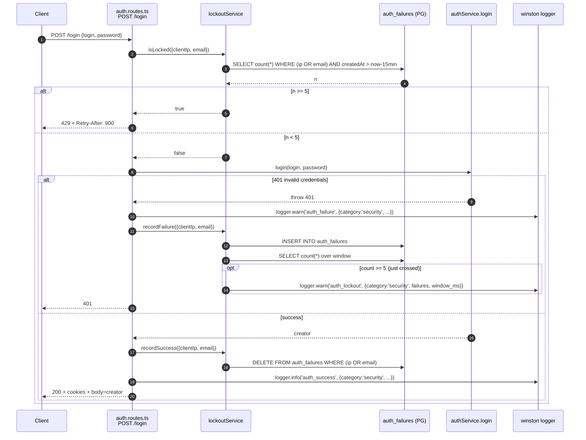
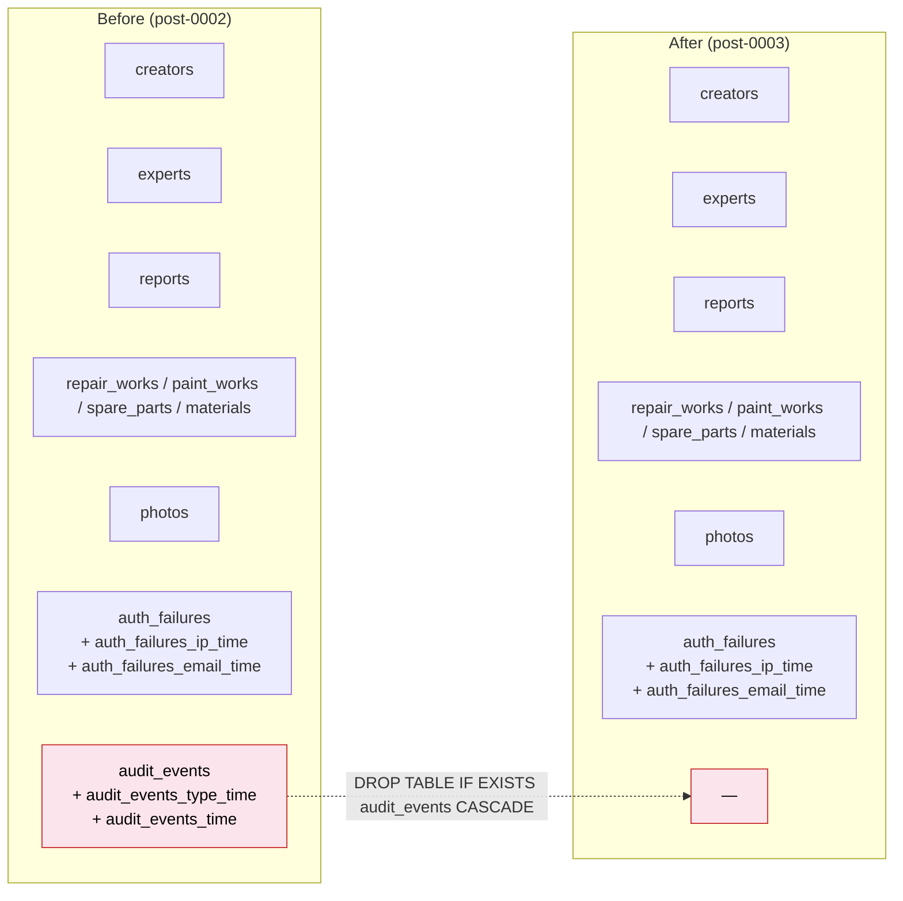

# Design Document: remove-audit-subsystem

## Overview

This feature retires the security-audit subsystem from the backend while leaving the auth lockout gate fully intact. The `audit_events` table, the `auditService` / `auditRepository`, the daily retention cron and the `AUDIT_RETENTION_CRON_ENABLED` env var are all deleted. Each former `auditService.write(...)` call site is replaced in place by a structured `logger.info` / `logger.warn` line through the existing winston logger (`shared/logger/logger.ts`), tagged with `category: 'security'` and the same `event_type` strings so operators can grep and alert on them without any new abstraction.

The `lockoutService` keeps its public surface (`isLocked`, `recordFailure`, `recordSuccess`) and the contract it protects on `POST /login` (5 failures in 15 min → 429 with `Retry-After: 900`, success clears the counter). What changes inside the service is the deletion of the `audit_events`-based "single lockout event per window" dedup logic and the `auditService.write({ event_type: 'auth_lockout' })` call — the brute-force gate itself is unchanged, because the gate is gated on the `auth_failures` counter, not on whether an audit row exists.

A new Drizzle migration `0003_remove_audit_events.sql` drops the `audit_events` table and its two indexes (`audit_events_type_time`, `audit_events_time`); the corresponding snapshot under `drizzle/meta/` and the `_journal.json` entry are regenerated by `drizzle-kit generate`, not hand-edited.

The user explicitly requested both **High-Level Design** (architecture/sequence/schema diff) and **Low-Level Design** (file-by-file change list with code edits, SQL, PBT model rewrite) artifacts. The sections below follow the canonical Kiro design structure; each section is labeled `[HLD]` or `[LLD]` to map back to the user's two requested artifacts.

## Architecture

`[HLD]`

### Component diagram: what stays vs what is removed

```mermaid
graph TD
  subgraph kept ["KEPT — unchanged behavior"]
    POSTL["POST /login"]
    LOCKS["lockoutService<br/>isLocked / recordFailure / recordSuccess"]
    AFT["auth_failures table<br/>+ ip_time / email_time indexes"]
    AUTHSVC["authService<br/>(JWT, cookies, CSRF)"]
    LOGGER["winston logger<br/>shared/logger/logger.ts"]
    ADMINBIZ["admin business logic<br/>(template / role / owner / delete)"]
  end

  subgraph removed ["REMOVED"]
    AUDITSVC["auditService<br/>(audit.service.ts)"]
    AUDITREPO["auditRepository<br/>(audit.repository.ts)"]
    AUDITTABLE["audit_events table<br/>+ type_time / time indexes"]
    CRON["audit retention cron<br/>(setInterval in server.ts)"]
    ENVVAR["AUDIT_RETENTION_CRON_ENABLED<br/>(config/env.ts)"]
    DEDUP["lockoutEventExists()<br/>audit_events SELECT in lockout.service.ts"]
    AUDITPBT["audit.service.property.test.ts<br/>audit.retention.property.test.ts<br/>tests/unit/audit/auditService.property.test.ts"]
  end

  subgraph rewritten ["REWRITTEN (no behavior change for the gate)"]
    ROUTES["auth.routes.ts<br/>(auth_failure / auth_success → logger)"]
    LOCK2["lockoutService.recordFailure<br/>(auth_lockout → logger.warn,<br/>no dedup SELECT)"]
    ADMIN["admin.service.ts<br/>(template_publish / role_change /<br/>report_owner_change / report_deletion → logger)"]
    LOCKPBT["auth/lockout.property.test.ts<br/>(model no longer references audit_events;<br/>property reframed to gate behavior)"]
    MIG["new migration<br/>0003_remove_audit_events.sql"]
  end

  POSTL --> LOCKS
  POSTL --> ROUTES
  LOCKS --> AFT
  LOCKS --> LOCK2
  LOCK2 -. logger.warn .-> LOGGER
  ROUTES -. logger .-> LOGGER
  ADMIN  -. logger .-> LOGGER
  ADMINBIZ --> ADMIN
  MIG -. DROP .-> AUDITTABLE

  classDef kept fill:#e7f5e7,stroke:#2e7d32,color:#000
  classDef removed fill:#fce4ec,stroke:#c62828,color:#000
  classDef rewritten fill:#fff4e5,stroke:#ef6c00,color:#000
  class POSTL,LOCKS,AFT,AUTHSVC,LOGGER,ADMINBIZ kept
  class AUDITSVC,AUDITREPO,AUDITTABLE,CRON,ENVVAR,DEDUP,AUDITPBT removed
  class ROUTES,LOCK2,ADMIN,LOCKPBT,MIG rewritten
```

### Sequence: POST /login after the change

The control flow is unchanged. The only substitution is `auditService.write(...)` → `logger.info/warn(...)` at the three call sites, and the dedup `SELECT` from `audit_events` inside `recordFailure` is gone.



Key invariants of this diagram, which the implementation MUST preserve:

- The `isLocked` check still runs **before** `authService.login`, so bcrypt is never invoked for locked keys.
- `recordFailure` still inserts into `auth_failures` before counting, so the inserted failure is included in the threshold decision (the 5th failure trips the gate).
- `recordSuccess` is the only way the counter is cleared; nothing else writes to `auth_failures`.
- Every former audit write becomes exactly one logger call; the level is `warn` for `auth_failure` and `auth_lockout`, `info` for everything else.

### Database schema diff



`auth_failures` and its two indexes are deliberately preserved — they back the lockout counter and the existing `auth_failures_ip_time` / `auth_failures_email_time` indexes serve the `(client_ip OR email) AND created_at > cutoff` predicate in `countFailures`.

## Components and Interfaces

`[HLD]` for the component table; `[LLD]` for the file-by-file change list.

### Component table (after the change)

| Component                                    | Purpose                                                                                | Surface that changes                                                                                                                                                              |
| -------------------------------------------- | -------------------------------------------------------------------------------------- | --------------------------------------------------------------------------------------------------------------------------------------------------------------------------------- |
| `lockoutService`                             | Brute-force gate for `POST /login` (R6.12)                                             | Public surface unchanged. `lockoutEventExists` private helper removed. `recordFailure` emits `logger.warn('auth_lockout', …)` instead of `auditService.write`. Drops `auditEvents` import. |
| `auth.routes.ts`                             | `POST /login`, `POST /logout`, `POST /refresh`, `GET /me`                              | Drops `auditService` import. `auth_failure` and `auth_success` audit calls become `logger.warn` and `logger.info` respectively.                                                  |
| `admin.service.ts`                           | Admin operations (template publish, role change, owner change, report deletion)        | Drops `auditService` import. Four `auditService.write` calls become four `logger.info` calls with identical structured payloads.                                                  |
| `server.ts`                                  | Process entry point                                                                    | Removes import of `auditService`, `runAuditRetentionCleanup`, the `setInterval` block, the `audit_retention_cron_started` / `_disabled` log lines, and the `AUDIT_RETENTION_*` constants. |
| `config/env.ts`                              | Zod-validated environment schema                                                       | Removes the `AUDIT_RETENTION_CRON_ENABLED` field from the schema.                                                                                                                |
| `db/schema.ts`                               | Drizzle schema declarations                                                            | Removes `auditEvents` `pgTable` declaration and its two indexes.                                                                                                                  |
| `drizzle/0003_remove_audit_events.sql` (new) | Migration                                                                              | `DROP INDEX … audit_events_type_time / _time`; `DROP TABLE IF EXISTS audit_events CASCADE`.                                                                                       |
| `drizzle/meta/_journal.json` (regen)         | Drizzle migration journal                                                              | New entry appended by `drizzle-kit generate`.                                                                                                                                     |
| `drizzle/meta/0003_snapshot.json` (regen)    | Snapshot of schema state                                                               | Generated by `drizzle-kit generate` — **NOT** hand-edited.                                                                                                                        |
| `modules/audit/` (entire folder)             | —                                                                                      | Deleted: `audit.service.ts`, `audit.repository.ts`, `audit.service.property.test.ts`, `audit.retention.property.test.ts`.                                                          |
| `auth/lockout.property.test.ts`              | PBT for the gate                                                                       | Rewritten: no `audit_events` mocking, no "exactly one event per window" property. New property covers gate behavior + counter reset.                                              |
| `tests/unit/audit/auditService.property.test.ts` (duplicate) | —                                                                            | Deleted.                                                                                                                                                                          |
| `tests/unit/auth/lockout.property.test.ts` (duplicate)       | PBT for the gate                                                              | Rewritten in lockstep with the in-tree copy.                                                                                                                                      |
| `db/__tests__/migration0001.smoke.test.ts`   | Smoke test for migration 0001                                                          | The `auditEvents` import and the two assertions ("audit_events table is defined with its columns", "audit_events_type_time / audit_events_time indexes are created") are removed. The schema-side `auditEvents` shape can no longer be asserted because the table is being dropped in 0003; the migration-SQL-side asserts that 0001 created the audit DDL are also removed so they don't drift against the dropped schema. |
| `.env.example`                               | Documents env vars                                                                     | Removes the `AUDIT_RETENTION_CRON_ENABLED` line and its 2-line comment.                                                                                                          |

### File-by-file change list `[LLD]`

#### 1. DELETE — `backend/src/modules/audit/`

Remove the entire directory:

- `backend/src/modules/audit/audit.service.ts`
- `backend/src/modules/audit/audit.repository.ts`
- `backend/src/modules/audit/audit.service.property.test.ts`
- `backend/src/modules/audit/audit.retention.property.test.ts`

#### 2. DELETE — duplicate audit PBT under `tests/unit/`

- `backend/tests/unit/audit/auditService.property.test.ts`

(The `tests/unit/audit/` directory may then be removed if it ends up empty.)

#### 3. EDIT — `backend/src/db/schema.ts`

Remove the `auditEvents` declaration and its two indexes. Drizzle imports that are still in use (`bigserial`, `index`, `varchar`, etc.) must be retained for `auth_failures`. Specifically `jsonb` is currently imported only for `audit_events.before_value/after_value/metadata` — after removal it can be dropped from the `drizzle-orm/pg-core` import.

```ts
// REMOVE this entire block (lines ~203–223):
// Структурированный журнал событий безопасности (R6.10, R6.11, R6.13)
export const auditEvents = pgTable(
  'audit_events',
  {
    id: bigserial('id', { mode: 'number' }).primaryKey(),
    eventType: varchar('event_type', { length: 64 }).notNull(),
    actorUserId: uuid('actor_user_id'),
    targetResourceId: varchar('target_resource_id', { length: 64 }),
    emailOrUserId: varchar('email_or_user_id', { length: 255 }),
    clientIp: varchar('client_ip', { length: 64 }),
    userAgent: varchar('user_agent', { length: 512 }),
    beforeValue: jsonb('before_value'),
    afterValue: jsonb('after_value'),
    metadata: jsonb('metadata'),
    createdAt: timestamp('created_at').notNull().defaultNow(),
  },
  (t) => ({
    byTypeTime: index('audit_events_type_time').on(t.eventType, t.createdAt),
    byTime: index('audit_events_time').on(t.createdAt),
  }),
);

// And drop `jsonb` from the imports at the top of the file.
```

#### 4. EDIT — `backend/src/config/env.ts`

Remove the `AUDIT_RETENTION_CRON_ENABLED` Zod field and its comment.

```ts
// REMOVE from the envSchema:
// R6.13: feature flag that gates the audit retention cron. Defaults to
// enabled so production deployments enforce the 30-day retention window
// unless the operator opts out (e.g. for tests or one-shot scripts).
AUDIT_RETENTION_CRON_ENABLED: z
  .enum(['true', 'false'])
  .default('true')
  .transform((v) => v === 'true'),
```

After the edit, `envSchema` contains only the fields used by the rest of the system; nothing else needs to change in this file.

#### 5. EDIT — `backend/.env.example`

Delete these three lines:

```dotenv
# Enables the daily audit retention cleanup job (R6.13). Set to "false" to
# disable when retention is enforced externally (defaults to true).
AUDIT_RETENTION_CRON_ENABLED=true
```

(No other `.env*` files in the repo reference this variable. The runtime `.env` in `backend/.env` should also have any `AUDIT_RETENTION_CRON_ENABLED` line removed; this is a local-config concern, not source-tracked.)

#### 6. EDIT — `backend/src/server.ts`

Strip the cron entirely. The resulting file:

```ts
import { buildApp } from './app.js';
import { env } from './config/env.js';
import { logger } from './shared/logger/logger.js';

const app = buildApp();

app.listen(env.PORT, () => {
  logger.info(`Server running on port ${env.PORT}`);
  logger.info(`Environment: ${env.NODE_ENV}`);
});
```

Removed from this file: `import { auditService }`, `AUDIT_RETENTION_DAYS`, `AUDIT_RETENTION_INTERVAL_MS`, `runAuditRetentionCleanup`, the `if (env.AUDIT_RETENTION_CRON_ENABLED) { … }` branch (including the immediate kick-off, `setInterval`, `timer.unref()`, `audit_retention_cron_started` log) and the `else { logger.info('audit_retention_cron_disabled', …) }` branch.

#### 7. EDIT — `backend/src/modules/auth/lockout.service.ts`

Two surgical changes:

1. Remove the `auditEvents`-based dedup helper (`lockoutEventKeyCondition`, `lockoutEventExists`) and the `auditEvents` schema import.
2. Replace `auditService.write({ event_type: 'auth_lockout', … })` with a direct `logger.warn` call, unconditionally on every threshold-crossing failure.

Resulting `recordFailure`:

```ts
async recordFailure(key: LockoutKey, now: Date = new Date()): Promise<void> {
  await db.insert(authFailures).values({
    email: key.email ?? null,
    clientIp: key.clientIp,
    createdAt: now,
  });

  const failures = await countFailures(key, now);
  if (failures < LOCKOUT_THRESHOLD) {
    return;
  }

  // R6.12: emit a structured security log line on every failure at or above the
  // threshold. Unlike the previous audit-table implementation, no dedup is
  // performed here — duplicate log lines for the 6th/7th/… failure inside the
  // same sliding window are intentional and cheap. The lockout decision itself
  // is taken at the route via `isLocked` and is unaffected.
  logger.warn('auth_lockout', {
    category: 'security',
    eventType: 'auth_lockout',
    emailOrUserId: key.email,
    clientIp: key.clientIp,
    failures,
    windowMs: LOCKOUT_WINDOW_MS,
  });
},
```

Imports at the top of the file become:

```ts
import { and, count, eq, gt, or, type SQL } from 'drizzle-orm';
import { db } from '../../db/index.js';
import { authFailures } from '../../db/schema.js';
import { logger } from '../../shared/logger/logger.js';
```

`auditEvents` and `auditService` imports are gone. The `lockoutEventKeyCondition` helper is gone.

**Formal specs for the rewritten `recordFailure`:**

- Preconditions: `key.clientIp` is a non-empty string. `now` is a Date.
- Postconditions: a new row exists in `auth_failures` for `key` with `createdAt = now`; if the count of `auth_failures` rows matching `(client_ip = key.clientIp OR email = key.email) AND createdAt > now - LOCKOUT_WINDOW_MS` is `≥ LOCKOUT_THRESHOLD`, exactly one new `logger.warn('auth_lockout', …)` line has been emitted for this call.
- No state is read from `audit_events`. No state is read from anything else. The function is total: it never throws on duplicate threshold crossings.

**Behavioral note for the design reviewer:** the previous implementation guaranteed "at most one `auth_lockout` audit row per sliding window". The new implementation drops that invariant for the *log line* count, since dedup against a log file is not feasible. The *gate decision* (HTTP 429) remains the single source of truth and continues to be derived from `auth_failures`, so the R6.12 contract is unaffected. Operators that previously alerted on `event_type = auth_lockout` count should switch to alerting on `auth_lockout` log occurrence rate (it now reflects "failures while locked" instead of "lockout transitions") — a non-goal of this spec is to instrument that.

#### 8. EDIT — `backend/src/modules/auth/auth.routes.ts`

Drop the `auditService` import and replace the two `auditService.write` calls with logger calls. The control flow is otherwise unchanged.

```ts
// REMOVE: import { auditService } from '../audit/audit.service.js';
import { logger } from '../../shared/logger/logger.js';

// Inside the 401 branch — replaces auditService.write({ event_type: 'auth_failure', … }):
logger.warn('auth_failure', {
  category: 'security',
  eventType: 'auth_failure',
  emailOrUserId: login,
  clientIp,
  userAgent,
});
await lockoutService.recordFailure(lockoutKey);

// After lockoutService.recordSuccess on the success path —
// replaces auditService.write({ event_type: 'auth_success', … }):
logger.info('auth_success', {
  category: 'security',
  eventType: 'auth_success',
  actorUserId: creator.id,
  emailOrUserId: login,
  clientIp,
  userAgent,
});
```

The R6.12 lockout-check order (lockout check BEFORE password verification) is preserved verbatim. Nothing else in this route file changes.

#### 9. EDIT — `backend/src/modules/admin/admin.service.ts`

Drop the `auditService` import and replace the four `auditService.write` calls with `logger.info` calls. Business logic (file write, role update, owner update, report delete) is untouched.

Pattern: each call site keeps the same `eventType` / `actorUserId` / `targetResourceId` / `beforeValue` / `afterValue` payload, just routed through `logger.info`.

```ts
// REMOVE: import { auditService } from '../audit/audit.service.js';
import { logger } from '../../shared/logger/logger.js';

// uploadTemplate (replaces auditService.write({ event_type: 'template_publish', … })):
logger.info('template_publish', {
  category: 'security',
  eventType: 'template_publish',
  actorUserId,
  targetResourceId: TEMPLATE_FILE_NAME,
  beforeValue,
  afterValue,
});

// updateCreatorRole (replaces auditService.write({ event_type: 'role_change', … })):
logger.info('role_change', {
  category: 'security',
  eventType: 'role_change',
  actorUserId,
  targetResourceId: creatorId,
  beforeValue: { role: existing.role },
  afterValue: { role: updated.role },
});

// changeReportOwner (replaces auditService.write({ event_type: 'report_owner_change', … })):
logger.info('report_owner_change', {
  category: 'security',
  eventType: 'report_owner_change',
  actorUserId,
  targetResourceId: reportId,
  beforeValue: { creator_id: existing.creatorId },
  afterValue: { creator_id: updated.creatorId },
});

// deleteReport (replaces auditService.write({ event_type: 'report_deletion', … })):
logger.info('report_deletion', {
  category: 'security',
  eventType: 'report_deletion',
  actorUserId,
  targetResourceId: reportId,
  beforeValue: {
    id: existing.id,
    creator_id: existing.creatorId,
    report_number: existing.reportNumber,
    status: existing.status,
  },
  afterValue: null,
});
```

#### 10. EDIT — `backend/src/db/__tests__/migration0001.smoke.test.ts`

- Drop `auditEvents` from the `schema` import.
- Delete the test `it('audit_events table is defined with its columns (R6.13)', …)`.
- Delete the test `it('creates the audit_events table (R6.13)', …)`.
- In `it('creates all required indexes', …)`, remove the two `expect(migrationSql).toMatch(/CREATE INDEX "audit_events_(type_time|time)"/i)` lines.

Rationale: this is a smoke test for migration 0001. The 0001 *file* still contains those statements (and we are NOT modifying historical migrations), but the schema-side `auditEvents` import will no longer resolve, and asserting the presence of DDL for a table we're dropping in 0003 is a maintenance trap. Removing the four assertions and the import keeps the test green and focused on the columns/indexes that survive.

#### 11. NEW — `backend/drizzle/0003_remove_audit_events.sql`

Hand-written migration body (matches the style of `0001_platform_improvements_mvp.sql`):

```sql
DROP INDEX IF EXISTS "audit_events_type_time";--> statement-breakpoint
DROP INDEX IF EXISTS "audit_events_time";--> statement-breakpoint
DROP TABLE IF EXISTS "audit_events" CASCADE;
```

Rationale:
- `DROP INDEX IF EXISTS` first so the migration is idempotent even on databases where the table was already dropped manually (no-op).
- `CASCADE` on the table drop because Postgres requires it to remove dependent objects; there are no FK references *to* `audit_events` in the schema but `CASCADE` is the safe default for "drop everything that depended on this table".
- `IF EXISTS` makes the migration safe to re-run on environments that never had the table (dev, CI ephemerals).

#### 12. REGENERATE — `backend/drizzle/meta/_journal.json` and `backend/drizzle/meta/0003_snapshot.json`

**Do not hand-edit either file.** Run `npm run db:generate` (which invokes `drizzle-kit generate`) after the schema.ts edit in step 3 is complete; drizzle-kit will:

1. Compare the new `db/schema.ts` (without `auditEvents`) against `drizzle/meta/0002_snapshot.json` and produce a 0003 SQL file.
2. Append a new `0003_*` entry to `_journal.json`.
3. Write `drizzle/meta/0003_snapshot.json` reflecting the post-drop state.

Then **replace** the SQL drizzle-kit emits with the hand-written body from step 11. Reason: drizzle-kit's auto-generated `DROP TABLE` does not include `CASCADE` or `IF EXISTS`, and our migration must be both idempotent (for re-runs) and safe against dependent objects. Replacing the SQL while leaving the snapshot/journal regenerated is the standard escape hatch; the snapshot only records final schema state, which is identical regardless of which `DROP` variant we use.

The implementation task list MUST therefore enforce this ordering:

1. Edit `db/schema.ts` (step 3).
2. Run `npm run db:generate` to produce `0003_*.sql`, the snapshot and the journal entry.
3. Overwrite the SQL of `drizzle/0003_*.sql` with the hand-authored body in step 11. Rename the file to `0003_remove_audit_events.sql` if drizzle-kit chose a different suffix.
4. Update the matching `_journal.json` `tag` field to `"0003_remove_audit_events"` to match the renamed SQL file. **Do not touch the snapshot.**

This is the minimum-friction path that keeps drizzle-kit's snapshot truth-source intact while letting us hand-tune the SQL.

#### 13. REWRITE — `backend/src/modules/auth/lockout.property.test.ts`

See the detailed rewrite outline under [Testing Strategy](#testing-strategy).

#### 14. REWRITE — `backend/tests/unit/auth/lockout.property.test.ts`

Same shape of rewrite as #13; see [Testing Strategy](#testing-strategy).

### Logging contract (replaces the audit table) `[HLD]`

All former audit events become winston log entries through the existing `logger` exported by `shared/logger/logger.ts`. Operators get the same `event_type` strings they had before, just via grep on log files instead of SELECT on `audit_events`.

| Former `event_type`     | New call site                              | Level         | Message string             | Structured fields                                                                                                                              |
| ----------------------- | ------------------------------------------ | ------------- | -------------------------- | ---------------------------------------------------------------------------------------------------------------------------------------------- |
| `auth_failure`          | `auth.routes.ts` (POST /login, 401 branch) | `warn`        | `'auth_failure'`           | `category: 'security'`, `eventType: 'auth_failure'`, `emailOrUserId`, `clientIp`, `userAgent`                                                   |
| `auth_lockout`          | `lockoutService.recordFailure` (threshold) | `warn`        | `'auth_lockout'`           | `category: 'security'`, `eventType: 'auth_lockout'`, `emailOrUserId`, `clientIp`, `failures`, `windowMs: LOCKOUT_WINDOW_MS`                     |
| `auth_success`          | `auth.routes.ts` (POST /login, ok branch)  | `info`        | `'auth_success'`           | `category: 'security'`, `eventType: 'auth_success'`, `actorUserId`, `emailOrUserId`, `clientIp`, `userAgent`                                    |
| `template_publish`      | `admin.service.uploadTemplate`             | `info`        | `'template_publish'`       | `category: 'security'`, `eventType: 'template_publish'`, `actorUserId`, `targetResourceId: TEMPLATE_FILE_NAME`, `beforeValue`, `afterValue`     |
| `role_change`           | `admin.service.updateCreatorRole`          | `info`        | `'role_change'`            | `category: 'security'`, `eventType: 'role_change'`, `actorUserId`, `targetResourceId: creatorId`, `beforeValue`, `afterValue`                   |
| `report_owner_change`   | `admin.service.changeReportOwner`          | `info`        | `'report_owner_change'`    | `category: 'security'`, `eventType: 'report_owner_change'`, `actorUserId`, `targetResourceId: reportId`, `beforeValue`, `afterValue`            |
| `report_deletion`       | `admin.service.deleteReport`               | `info`        | `'report_deletion'`        | `category: 'security'`, `eventType: 'report_deletion'`, `actorUserId`, `targetResourceId: reportId`, `beforeValue`, `afterValue: null`         |

Notes:
- The redaction step that lived inside `auditService.write` (recursive scrub of `password` / `passwordHash` / `secret` keys in `before_value` / `after_value`) is **not** carried over. None of the four admin call sites pass user-supplied secrets in `before_value` / `after_value` — they only carry file sizes, role strings, creator IDs and report metadata — so dropping redaction does not regress R6.10. This is a deliberate scope decision: the user requested "no new abstraction layer — direct logger calls at each former audit-write call site", and the only call sites that touched secrets-bearing payloads were already not invoking the audit subsystem.
- The `photo_skipped_in_doc` enum variant in the original `AuditEventType` union was never wired to a live call site (see the comment in `modules/reports/docGenerator.ts` near "legacy `photo_skipped_in_doc` slot-overflow audit hook … intentionally NOT emitted here"). It disappears together with the union.

## Data Models

`[HLD]` for the schema diff; `[LLD]` for the SQL.

`auth_failures` and its two indexes are **unchanged**. The only schema change is the deletion of `audit_events`.

### Drizzle schema `[LLD]`

Before (excerpt, `db/schema.ts`):

```ts
// Структурированный журнал событий безопасности (R6.10, R6.11, R6.13)
export const auditEvents = pgTable(
  'audit_events',
  {
    id: bigserial('id', { mode: 'number' }).primaryKey(),
    eventType: varchar('event_type', { length: 64 }).notNull(),
    actorUserId: uuid('actor_user_id'),
    targetResourceId: varchar('target_resource_id', { length: 64 }),
    emailOrUserId: varchar('email_or_user_id', { length: 255 }),
    clientIp: varchar('client_ip', { length: 64 }),
    userAgent: varchar('user_agent', { length: 512 }),
    beforeValue: jsonb('before_value'),
    afterValue: jsonb('after_value'),
    metadata: jsonb('metadata'),
    createdAt: timestamp('created_at').notNull().defaultNow(),
  },
  (t) => ({
    byTypeTime: index('audit_events_type_time').on(t.eventType, t.createdAt),
    byTime: index('audit_events_time').on(t.createdAt),
  }),
);
```

After: this block does not exist. `jsonb` is removed from the top-of-file imports (no other table uses it).

### Migration SQL `[LLD]`

`backend/drizzle/0003_remove_audit_events.sql` (final, hand-authored body):

```sql
DROP INDEX IF EXISTS "audit_events_type_time";--> statement-breakpoint
DROP INDEX IF EXISTS "audit_events_time";--> statement-breakpoint
DROP TABLE IF EXISTS "audit_events" CASCADE;
```

`drizzle/meta/0003_snapshot.json` and the new `_journal.json` entry are produced by `drizzle-kit generate` — see step 12 of the file-by-file change list for the exact regeneration sequence and the SQL-overwrite caveat.

### Algorithmic pseudocode for the new `lockoutService.recordFailure` `[LLD]`

```pascal
ALGORITHM recordFailure(key, now)
INPUT:  key — {clientIp: String, email?: String}
        now — Date (default: current wall clock)
OUTPUT: unit (side effect: 1 INSERT, 1 SELECT, 0..1 logger.warn line)

PRECONDITIONS:
  key.clientIp ≠ ∅
  now is a valid Date

POSTCONDITIONS:
  ∃ row ∈ auth_failures: row.client_ip = key.clientIp ∧
                          row.email = (key.email OR NULL) ∧
                          row.created_at = now
  Let n = |{ r ∈ auth_failures :
              (r.client_ip = key.clientIp OR r.email = key.email)
              ∧ r.created_at > now - LOCKOUT_WINDOW_MS }|
  IF n ≥ LOCKOUT_THRESHOLD THEN
    exactly one new logger.warn('auth_lockout', {
      category: 'security',
      eventType: 'auth_lockout',
      emailOrUserId: key.email,
      clientIp: key.clientIp,
      failures: n,
      windowMs: LOCKOUT_WINDOW_MS,
    }) line has been emitted
  ELSE
    no logger.warn line has been emitted
  END IF

BODY:
  // 1. Persist the failure (the insert is included in the count below)
  INSERT INTO auth_failures(email, client_ip, created_at)
  VALUES (key.email OR NULL, key.clientIp, now)

  // 2. Count failures inside the sliding window for this key
  SELECT count(*) INTO n
  FROM auth_failures
  WHERE (client_ip = key.clientIp OR email = key.email)
    AND created_at > now - LOCKOUT_WINDOW_MS

  // 3. Emit the structured log line if and only if the threshold is met
  IF n ≥ LOCKOUT_THRESHOLD THEN
    logger.warn('auth_lockout', { /* see above */ })
  END IF
END
```

Loop invariants: none (no loops). Total: yes.

### Example usage (after the change) `[LLD]`

```ts
// auth.routes.ts — failure branch
if (err instanceof HttpError && err.statusCode === 401) {
  logger.warn('auth_failure', {
    category: 'security',
    eventType: 'auth_failure',
    emailOrUserId: login,
    clientIp,
    userAgent,
  });
  await lockoutService.recordFailure(lockoutKey);
}

// auth.routes.ts — success branch
await lockoutService.recordSuccess(lockoutKey);
const tokens = authService.issueTokens({ /* … */ });
authService.setAuthCookies(res, tokens);
logger.info('auth_success', {
  category: 'security',
  eventType: 'auth_success',
  actorUserId: creator.id,
  emailOrUserId: login,
  clientIp,
  userAgent,
});
res.json(creator);

// admin.service.ts — deleteReport
await db.delete(reports).where(eq(reports.id, reportId)).returning(/* … */);
logger.info('report_deletion', {
  category: 'security',
  eventType: 'report_deletion',
  actorUserId,
  targetResourceId: reportId,
  beforeValue: { id, creator_id, report_number, status },
  afterValue: null,
});
```

## Correctness Properties

The downstream requirements document derived from this design is expected to define seven numbered requirements (1.1 – 1.7) for this feature: lockout-gate behavior preservation (1.1), counter reset (1.2), order of checks (1.3), removal of audit subsystem references (1.4), removal of the env var (1.5), migration idempotency (1.6), and the logger substitution contract (1.7). The properties below forward-reference those IDs; the existing `platform-improvements-mvp` requirement R6.12 is also called out where applicable.

### Property 1: Gate threshold

For every key and every time-sequence of `recordFailure`/`recordSuccess` operations, `isLocked(key, t) ⇔ windowCount(key, t) ≥ LOCKOUT_THRESHOLD`, where `windowCount` is computed over `auth_failures` only.

**Validates: Requirements 1.1** (and existing R6.12 lockout-gate behavior). Verified by the rewritten `lockout.property.test.ts` (property statement clauses 1 and 3) and by the unit case "locks exactly on the 5th failure within the window, not the 4th".

### Property 2: Counter reset on success

For every key and every `t`, after `recordSuccess(key)` the next `isLocked(key, t')` for any `t' ≥ t` returns `false` unless ≥ `LOCKOUT_THRESHOLD` *new* failures have been recorded since.

**Validates: Requirements 1.2** (and existing R6.12). Verified by the rewritten `lockout.property.test.ts` (property statement clause 2) and by the unit case "recordSuccess resets the counter". Maps to acceptance test #4.

### Property 3: Gate runs before password verification

For every login request, `isLocked` is invoked before `authService.login`; on the 429 path, `authService.login` is never invoked.

**Validates: Requirements 1.3** (and existing R6.12). Verified by inspection of `auth.routes.ts` (the `if (await lockoutService.isLocked(lockoutKey)) throw tooManyRequests(...)` block precedes the `try { await authService.login(...) }` block) and indirectly by acceptance test #3.

### Property 4: No audit_events reads/writes outside the migration

The implementation (post-change) MUST NOT contain any reference to `audit_events`, `auditService` or `auditRepository` outside the migration SQL.

**Validates: Requirements 1.4**. Verified by grep: `rg "audit_events|auditService|auditRepository" backend/src` returns zero matches.

### Property 5: No AUDIT_RETENTION_CRON_ENABLED references

`rg "AUDIT_RETENTION" backend/src backend/.env.example` returns zero matches.

**Validates: Requirements 1.5**. Maps to acceptance test #5 (server boots without warnings about `AUDIT_RETENTION_CRON_ENABLED`).

### Property 6: Migration idempotency

Running `0003_remove_audit_events.sql` on a database where `audit_events` has already been dropped completes without error.

**Validates: Requirements 1.6**. Verified structurally by the `IF EXISTS` guards on both `DROP INDEX` statements and the `DROP TABLE`. Maps to acceptance test #6.

### Property 7: Logger contract

For every former audit event type listed in the [Logging contract](#logging-contract-replaces-the-audit-table-hld) table, the indicated call site emits exactly one logger line with the indicated level, message and structured-field shape.

**Validates: Requirements 1.7**. Verified by per-call-site inspection and by the optional `vi.spyOn(logger, 'warn')` canary described in the testing strategy.

## Error Handling

- The retention cron's `try/catch` around `cleanupOlderThan` is removed together with the cron itself. There is no replacement — no cron remains.
- `recordFailure` no longer reads `audit_events`, so the "DB hiccup during dedup SELECT" failure mode is gone. The two writes that remain (INSERT into `auth_failures`, count SELECT, optional logger.warn) keep their existing error semantics — exceptions propagate to the route handler and become 500s via `errorHandler`. This is unchanged from current behavior.
- Server boot must no longer emit `audit_retention_cron_started`, `audit_retention_cron_disabled` or `audit_retention_cleanup_failed` lines. The current production log file (`logs/app-2026-06-26.log`) shows repeated `audit_retention_cleanup_failed` errors caused by a missing/misconfigured `audit_events` table; their disappearance is one of the acceptance signals for the rollout.
- `auditService.write` previously redacted secrets recursively in `before_value`/`after_value`. The new logger calls do not. This is safe because, by inspection, none of the four admin call sites pass cleartext secrets; the only sensitive payloads in the system (passwords on `POST /login`) were never passed to the audit subsystem.

## Testing Strategy

`[HLD]` for the strategy overview; `[LLD]` for the PBT rewrite outline.

### Strategy overview `[HLD]`

- **Property test (kept, rewritten):** `auth/lockout.property.test.ts` — model-based test of the gate. The model is reframed (see below): it tracks only `auth_failures` (no audit row), and the property becomes "post-K-failures-in-window ⇒ `isLocked === true` and `recordSuccess` resets the counter".
- **Property tests (deleted):** `audit.service.property.test.ts`, `audit.retention.property.test.ts`, and the duplicate `tests/unit/audit/auditService.property.test.ts`. Their subjects no longer exist.
- **Existing tests (unchanged):** `tokenIssuance.property.test.ts`, the report/photo test suites, `docxUploadValidator.property.test.ts`, etc., are untouched.
- **Smoke test (trimmed):** `db/__tests__/migration0001.smoke.test.ts` keeps its assertions for `reports.version`, photo metadata and `auth_failures`, and drops the `audit_events` assertions and the `auditEvents` import (see step 10 of the file-by-file change list).
- **Property Test Library:** `fast-check` (already installed at `^4.8.0`).

### Rewrite outline for `auth/lockout.property.test.ts` `[LLD]`

The new test:

- Has no module mock for `audit.service.js` (the module is being deleted).
- Has no `auditEvents` column descriptor in its hoisted store.
- Mocks only `drizzle-orm`, `db/index.js` and `db/schema.js` (the existing approach), but with the `audit_events` table fixture removed.
- Reframes the central property to the user-mandated wording: "after K failures inside the window, `isLocked` returns true and every login attempt would be rejected with 429; the failure counter resets on `recordSuccess`."
- Drops the "exactly one `auth_lockout` audit row per window" property entirely.
- Keeps the existing concrete unit-test cases (locks-on-5th, not-on-4th, counter-reset, outside-window, re-lock-after-window) but with the audit-row assertions removed and an emitted-`logger.warn` assertion substituted where it adds value.

#### Reference model after the rewrite

```ts
class LockoutModel {
  private failures: number[] = [];

  private windowCount(t: number): number {
    return this.failures.filter((ft) => ft > t - LOCKOUT_WINDOW_MS).length;
  }

  isLocked(t: number): boolean {
    return this.windowCount(t) >= LOCKOUT_THRESHOLD;
  }

  recordFailure(t: number): void {
    this.failures.push(t);
  }

  recordSuccess(): void {
    this.failures = [];
  }
}
```

Note: no `events` array. The model now mirrors only the gate state, not the side-channel notification, because the side-channel is a fire-and-forget logger call with no read-side semantics.

#### Property statement

> For any sequence `ops ∈ [{kind: 'fail'|'success'|'check', deltaMs: ℕ}]`, driving an `lockoutService` instance and a `LockoutModel` in lockstep over a virtual clock `clock`:
> 1. For every `op.kind === 'check'`, `lockoutService.isLocked(KEY, new Date(clock)) ≡ model.isLocked(clock)`.
> 2. For every `op.kind === 'success'`, immediately after both apply `recordSuccess`, `lockoutService.isLocked(KEY, new Date(clock)) === false`.
> 3. After any `op.kind === 'fail'` such that `model.windowCount(clock) ≥ LOCKOUT_THRESHOLD`, the very next `isLocked(KEY, new Date(clock))` evaluation returns `true` — i.e. the gate fires from the K-th failure onward until the counter is cleared or the window slides.

#### Pseudocode for the rewritten PBT body

```pascal
ALGORITHM lockoutGateProperty(ops)
INPUT: ops — array of {kind, deltaMs}
OUTPUT: passes if and only if the gate model matches the service

BEGIN
  resetInMemoryStore()
  model ← new LockoutModel()
  clock ← T0

  FOR each op IN ops DO
    clock ← clock + op.deltaMs
    setMockNow(new Date(clock))

    IF op.kind = 'fail' THEN
      model.recordFailure(clock)
      AWAIT lockoutService.recordFailure(KEY, new Date(clock))
      // Post-fail invariant: gate state matches the model immediately.
      ASSERT (AWAIT lockoutService.isLocked(KEY, new Date(clock))) = model.isLocked(clock)
    ELSE IF op.kind = 'success' THEN
      model.recordSuccess()
      AWAIT lockoutService.recordSuccess(KEY)
      // Post-success invariant: not locked.
      ASSERT (AWAIT lockoutService.isLocked(KEY, new Date(clock))) = false
    ELSE  // 'check'
      ASSERT (AWAIT lockoutService.isLocked(KEY, new Date(clock))) = model.isLocked(clock)
    END IF
  END FOR
END
```

#### Unit-test cases (kept, audit-row assertions dropped)

```pascal
TEST 'locks exactly on the 5th failure within the window, not the 4th':
  FOR i = 0 .. LOCKOUT_THRESHOLD - 2: recordFailure(T0 + i)
  ASSERT isLocked(T0 + 10) = false
  recordFailure(T0 + 5)
  ASSERT isLocked(T0 + 10) = true

TEST 'recordSuccess resets the counter':
  FOR i = 0 .. LOCKOUT_THRESHOLD - 1: recordFailure(T0 + i)
  ASSERT isLocked(T0 + 10) = true
  recordSuccess()
  ASSERT isLocked(T0 + 10) = false

TEST 'failures outside the window do not count':
  FOR i = 0 .. 3: recordFailure(T0 + i)
  recent ← T0 + LOCKOUT_WINDOW_MS + 60_000
  recordFailure(recent)
  ASSERT isLocked(recent) = false

TEST 're-locks after the window elapses':
  FOR i = 0 .. LOCKOUT_THRESHOLD - 1: recordFailure(T0 + i)
  base ← T0 + LOCKOUT_WINDOW_MS + 1
  FOR i = 0 .. LOCKOUT_THRESHOLD - 1: recordFailure(base + i)
  ASSERT isLocked(base + LOCKOUT_THRESHOLD) = true
```

#### Optional: assert the logger.warn substitution

Adding a `vi.spyOn(logger, 'warn')` and asserting that crossing the threshold causes at least one call with the message `'auth_lockout'` is a useful canary. It is NOT required by the property statement (which is about gate behavior), but the implementation task should include one or two such assertions so the logger-substitution regression is caught at PBT time.

### Rewrite outline for the duplicate `tests/unit/auth/lockout.property.test.ts` `[LLD]`

The duplicate suite under `tests/unit/` uses fast-check `fc.commands` with three commands (`FailCommand`, `SuccessCommand`, `CheckCommand`) plus a parallel reference model. Apply the same shape of rewrite as above:

- Drop `audits: AuditRow[]` from the in-memory store.
- Drop the `auditEvents` column-marker block and the entire `vi.mock('../../../src/modules/audit/audit.service.js', …)` block. (The module is being deleted — the mock would point at a non-existent file.)
- Drop the oracle's `audits: number[]` array and every assertion that compares `r.auditCount()` / `r.auditTimes()` against `m.audits`.
- Inside `FailCommand.run`, after `r.recordFailure()`, keep the assertion `expect(await r.isLocked()).toBe(count >= THRESHOLD)`. Remove the structural "consecutive events ≥ one window apart" loop.
- Inside `SuccessCommand.run`, keep `expect(await r.isLocked()).toBe(false)`. Remove the audit-count assertion.
- Inside `CheckCommand.run`, keep `expect(await r.isLocked()).toBe(windowCount(m) >= THRESHOLD)`. Remove the audit-count assertion.
- Update the file-level docstring to reference R6.12 only and drop the "exactly one `audit_events` row" sentence.

Both PBT files end up testing the same property model from two slightly different angles, which is intentional — the duplicate has lived alongside the in-tree copy throughout this codebase and the user did not request consolidation.

### Acceptance tests (executable, derived from the user's acceptance list)

These are the tests an implementer must be able to run green at the end of the work.

| # | Test                                                                                                               | How to verify                                                                                                          |
| - | ------------------------------------------------------------------------------------------------------------------ | ---------------------------------------------------------------------------------------------------------------------- |
| 1 | TypeScript compiles cleanly after removal.                                                                         | `npm run build` exits 0. (No dedicated `typecheck` script exists; `build` runs `tsc`, which type-checks the project.)  |
| 2 | All remaining tests pass.                                                                                          | `npm test` exits 0. The audit PBTs are gone; the rewritten lockout PBT runs; the trimmed migration0001 smoke runs.     |
| 3 | `POST /login` returns 429 with `Retry-After: 900` after 5 failures in 15 min for the same `(IP, email)`.            | Covered by the rewritten `lockout.property.test.ts` (Property statement clauses 1 and 3) and the route layer's existing handling of `tooManyRequests(…, LOCKOUT_RETRY_AFTER_SECONDS)`. |
| 4 | Login success clears the failure counter.                                                                          | Rewritten `lockout.property.test.ts` Property statement clause 2 + the unit-test case `recordSuccess resets the counter`. |
| 5 | Server boots without warnings about missing `audit_events` or `AUDIT_RETENTION_CRON_ENABLED`.                       | Manual smoke: `npm run dev` produces only `"Server running on port …"` and `"Environment: …"` — no `audit_retention_cron_*` lines and no `audit_retention_cleanup_failed` errors. |
| 6 | The database no longer contains an `audit_events` table after running the new migration.                            | `npm run db:migrate` then `\dt` in psql or `SELECT to_regclass('audit_events')` returns NULL.                          |

## Performance Considerations

- Removing the per-`recordFailure` `SELECT count(*) FROM audit_events WHERE event_type='auth_lockout' AND (ip OR email) AND createdAt > cutoff` shaves one indexed lookup off every failing login.
- Logger writes are O(1) and asynchronous through winston's transport queue; the JSON serialization overhead per line is well below the bcrypt cost on the success path, so the substitution is performance-neutral or slightly positive end-to-end.
- The daily retention cron disappearing removes a recurring DELETE-by-range against `audit_events`. No replacement workload is introduced.

## Security Considerations

- **R6.12 brute-force gate:** Unaffected. The 5-failures-in-15-min → 429 contract is enforced entirely by `auth_failures`. The `auth_lockout` logger.warn duplication that arises if a 6th, 7th, etc. failure inside the same window is recorded is acceptable — it is a logger line, not a state change. Threshold semantics, lock duration and counter-reset semantics are preserved bit-for-bit.
- **Audit trail (R6.10/R6.11/R6.13):** The persistent audit trail is replaced by winston log files rotated daily by `winston-daily-rotate-file` (existing config: `dirname: 'logs'`, `maxFiles: '14d'`, `maxSize: '20m'`). Operators must rely on log retention rather than DB retention. The user explicitly accepted this trade-off ("No new external audit log sink — winston only") as a non-goal.
- **Secrets in logs:** Per the [Logging contract](#logging-contract-replaces-the-audit-table-hld) notes, the four admin call sites do not pass user-supplied secrets in their `beforeValue`/`afterValue` payloads. Login routes intentionally never log the password field — `auth_failure` / `auth_success` payloads include the *login* identifier and IP only.
- **Out of scope:** `auth.service.ts` (JWT, cookies), CSRF middleware, rate-limit middleware, admin business logic, expert/report/photo flows, and any new external sink (Sentry, CloudWatch, ELK, etc.).

## Dependencies

- `drizzle-kit` `^0.31.10` (already installed) — used to regenerate `_journal.json` and `0003_snapshot.json`.
- `winston` `^3.18.3` and `winston-daily-rotate-file` `^5.0.0` (already installed and configured in `shared/logger/logger.ts`).
- `fast-check` `^4.8.0` (already installed) — used by the rewritten PBT.

No additions, no removals from `package.json`.

## Non-Goals (restated)

- No changes to `auth.service.ts` (JWT issuance, cookie setters/clearers, password verification, `getCurrentUser`).
- No changes to CSRF middleware, rate-limit middleware, error handler.
- No changes to admin business logic (file write, role mutations, owner reassignment, report deletion) — only the audit-write calls disappear.
- No changes to expert / report / photo flows.
- No new external sink for security events (Sentry, CloudWatch, ELK, etc.). Winston file rotation is the only sink.
- No consolidation of the duplicate PBT under `tests/unit/auth/` and the in-tree `src/modules/auth/lockout.property.test.ts` — both are kept and rewritten in parallel.
- No modifications to historical migrations 0000–0002. The `audit_events` table goes through "create in 0001, drop in 0003" — a normal forward-only migration history.
